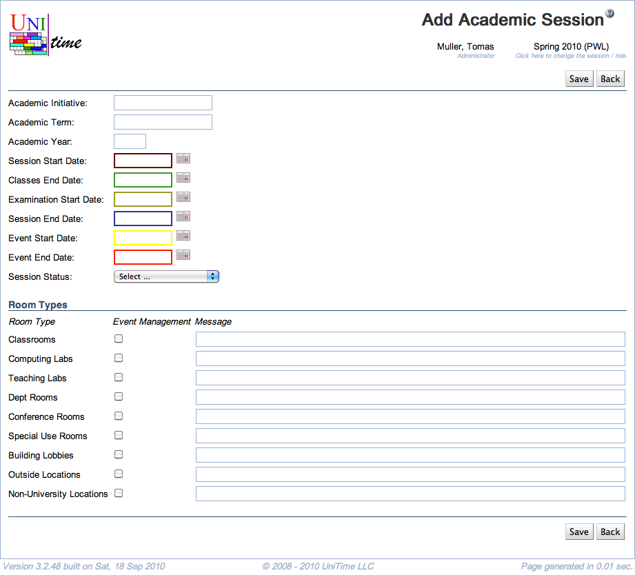

## Screen Description

 In the Add Academic Session screen, you can define a new academic session, including e.g. its start and end date or holidays throughout a term.

## Details

* **Academic Initiative**
	* Name of the academic initiative (for example, a campus within a university)

* **Academic Term**
	* Term (semester) of this academic session

* **Academic Year**
	* Year of this academic session

* **Session Start Date**
	* The date when the session begins

* **Classes End Date**
	* The date when classes end

* **Examination Start Date**
	* The first date of final examinations

* **Session End Date**
	* The date when session ends (for example, a session can end after final exams, a week or two after the classes end)

* **Events Start Date**
	* First date for which events can be entered for this academic session

* **Events End Date**
	* Last date for which events can be entered for this academic session

* **Session Status**
	* The session status indicates what users can do within a session
	* The options are set up in the [Status Types](status-types)
	* The current basic statuses are
		* Initial Data Load: Populating data from other resources or from the previous like-term before the schedule managers are allowed to start working in this session
		* Input Data Entry: Schedule managers can edit input data and run the solver, but they cannot commit a timetable
		* Timetabling: The schedule managers can edit data, create and commit timetables
		* Timetabling Published: No schedule manager can edit input data or change timetables

* **Holidays**
	* This part is displayed after the Academic Year and Start and End dates are filled in
	* A calendar appears for a period of time from one month before the start date to one month after the end date of the academic term
	* Indicate holidays and breaks within the academic session by clicking on the colored squares in legend and then on dates in the calendar (classes are not held on these days)

### Room Types

 In the Room Types section it can be selected which types of rooms (locations) can be used for event management. The locations that should be used still need to be controlled by a department that has an event manager associated with it, otherwise they cannot be used.

* **Room Type**
	* Room type - one of the types defined in the [Room Types](room-types) administrative screen

* **Event Management**
	* If the checkbox is checked, the appropriate room type can be used in event management

* **Message**
	* Not in use at the moment

## Operations

* **Save**
	* Save the new academic session and go back to the [Academic Sessions](academic-sessions) screen

* **Back**
	* Go back to the [Academic Sessions](academic-sessions) screen without saving the new session

{:class='screenshot'}
