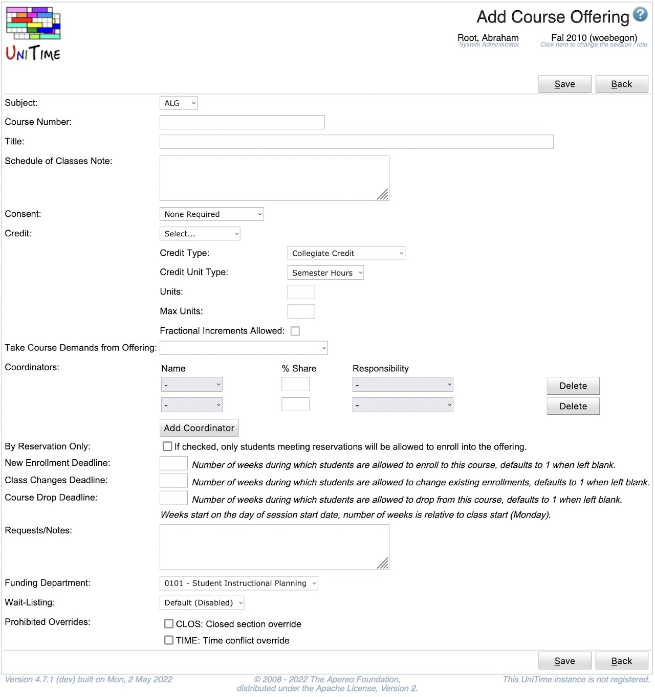

## Screen Description

The Add Course Offering page can be used to create a new course offering. Together with a course offering, instructional offering is also created and the new course offering is marked as controlling (see [Instructional Offering Cross List](instructional-offering-cross-lists)).

{:class='screenshot'}

## Details

* **Subject**
	* The subject area for the new course offering

* **Course Number**
	* Course number for the new course offering

* **Title**
	* The title for the course

* **Type**
	* If there are course types defined, a course type can be selected from a drop down. See [Course Types](course-types) page for more details.

* **Schedule of Classes Note**
	* The note that will be displayed in the schedule book as a note for the whole course

* **Consent**
	* The type of consent that is required
	* Options: None (leave the "Select..." there), Consent of Department, Consent of Instructor. See [Offering Consent Types](offering-consent-types) page for more details.

* **Credit**
	* Options: Arrange Hours, Fixed Unit, Variable Min/Max, Variable Range
	* In most cases the Credit is Fixed Unit
	* **Credit Type**
		* Variable credit type: E-Equivalent; C-Continuing Education Units; M-Masters; P-PhD Thesis
	* **Credit Unit Type**
		* Indicates time frame for credit hour awarded
	* **Units** and **Max Units**
		* Amount of Credit awarded for the Course
		* For fixed credit courses, the single credit associated with the course will be listed in the Units field
		* For variable credit courses, e.g., credit 1-5, the first value in the range will be listed in the Units field and the ending value for the range will be listed in the Max Units field
	* **Fractional Increments Allowed**
		* Any course that has variable credit can be taken for fractional credit, e.g., if credit range is 1-5, an individual could make arrangements to earn 2.5 credits
		* Editable only by administrators
	* See [Course Credit](course-credit) for more details.

* **Take Course Demands from Offering**
	* For a new course (a course that has not been offered last-like semester), you can optionally select an existing course offering from the drop down menu to indicate the new course is expected to enroll the same or similar set of students as the selected course. This information is used in the timetabling to reflect potential student conflicts.
	* Useful when you are renumbering a course - the new number is ME 443, but you know that this course will be taken by the same students as ME 495T in the past - in that case, you will select ME 495T in the drop down.
	* For majority of your courses, you will not be using this drop down

* **Coordinators**
	* A list of instructors (from the department to which the course belongs) who will be able to provide the consent of instructor required for the course

	* **Delete**
		* Click to delete the coordinator on the same line

	* **Add Coordinator**
		* Click to add another line with the drop down list of possible coordinators

* **By Reservation Only**
	* A checkbox indicating whether it is possible to enter the course without meeting its reservation criteria (if checked, only students meeting reservations will be allowed to enroll into the offering)

* **Deadlines**
	* These deadlines are used to control enrollment during online student scheduling (both via scheduling assistant and wait-list). The defaults are set on the academic session ([Edit Academic Session](edit-academic-session)), but can be overridden on each instructional offering.
	* Deadlines are given in the number of weeks, relative to the class start (weeks start on the day of the session begin date).

* **Requests / Notes**
	* A note that schedule managers can use to describe the scheduling needs for the course.  This can be used to document why certain things are/were being configured for the course.

* **Funding Department**
	* The department funding the classes for this course if they are funded by a department other than the department which is funding the subject area.
		* This column is not visible by default.  To enable this column the `unitime.courses.funding_departments_enabled` application property must be set to `true`.

* **Wait-Listing**
	* Set whether wait-listing for the instructional offering follows the default wait-listing value set via the `unitime.offering.waitListDefault` application property or is Enabled or Disabled.

* **Prohibited Overrides**
	* If there are override types defined, it is possible to mark which of the override types students are prohibited from requesting for the course offering. See [Override Types](override-types) page for more details.

## Operations

* **Save** (Alt+S)
	* Create a new course offering and go to the [Instructional Offering Detail](instructional-offering-detail) screen.

* **Back** (Alt+B)

* Go back to the [Instructional Offerings](instructional-offerings) screen without saving any changes.

## Notes

Course number format is controlled by the regular expression in the tmtbl.courseNumber.pattern application property. If the validation fails, the message from tmtbl.courseNumber.patternInfo property is displayed. It is possible to allow for non unique course numbers by setting the application property tmtbl.courseNumber.unique to false. When application property tmtbl.courseNumber.upperCase is set to true, course numbers are automatically upper cased. These properties can be changed using the [Application Configuration](application-configuration) page, the default settings is as follows:

```
tmtbl.courseNumber.pattern=^[0-9][0-9][0-9]([A-Za-z]){0,1}$
tmtbl.courseNumber.patternInfo=Course Number must have 3 numbers followed by an optional letter (e.g. 214, 342X)
tmtbl.courseNumber.unique=false
tmtbl.courseNumber.upperCase=true
```
