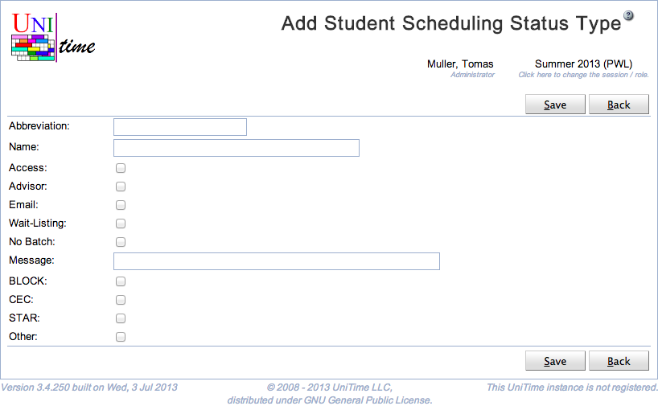

## Screen Description

 The Add Student Scheduling Status Type screen provides interface for adding a new student scheduling status type. When the status type is applied to a particular student, it influences the student's or his/her advisor's abilities to enroll the student into classes during online scheduling.

## Details

* **Abbreviation**
	* Abbreviation of the scheduling status (as displayed e.g. in the Students table in the [Online Student Scheduling Dashboard](http://help.unitime.org/Online_Student_Scheduling_Dashboard) screen)

* **Name**
	* Name of the scheduling status

* **Assistant**
	* Indicates whether the student has access to the [Student Scheduling Assistant](student-scheduling-assistant) page
	* This also indicates whether student advisors and other administrative users can access the [Student Scheduling Assistant](student-scheduling-assistant) page on behalf of the student

* **Student Enroll**
	* Indicates whether the student can use the Enroll button (a student can have access to online scheduling assistant without the ability to make changes)

* **Advisor Enroll**
	* Indicates whether the student advisor (Student Scheduling Advisor permission) has access to online scheduling (can make changes on behalf of a student)

* **Admin Enroll**
	* Indicates whether the scheduling administrator (Student Scheduling Admin permission) has access to online scheduling (can make changes on behalf of a student)

* **Registration**
	* Indicates whether the student has access to the [Student Course Requests](student-course-requests) page
	* This also indicates whether student advisors and other administrative users can access the [Student Course Requests](student-course-requests) page on behalf of the student

* **Student Register**
	* Indicates whether the student can use the Save button (a student can have access to course requests without the ability to make changes)

* **Advisor Register**
	* Indicates whether the student advisor (Student Scheduling Advisor permission) has access to course requests (and can make changes on behalf of a student)

* **Admin Enroll**
	* Indicates whether the scheduling administrator (Student Scheduling Admin permission) has access to course requests (and can make changes on behalf of a student)

* **Email**
	* Indicates whether the student should be able to receive emails (e.g. sent via the [Online Student Scheduling Dashboard](online-student-scheduling-dashboard))

* **Wait-Listing**
	* Indicate whether wait-listing is available for the student

* **No Batch**
	* When checked, student class enrollments cannot be changed during batch student scheduling ([Student Sectioning Solver](student-scheduling-solver) screen). These students, however, do count against the class / configuration / course / reservation limits.

* **Advisor Can Set Status**
	* Student advisors can use the [Online Student Scheduling Dashboard](online-student-scheduling-dashboard) to change student status to this status (must have Student Scheduling Change Student Status permission)

* **Course Request Validation**
	* Use the custom course request validation when configured. Custom course request validation can be used to provide additional validation for the entered course requests, to request overrides, and/or to check student eligibility to register.

* **Special Requests**
	* Use the custom special registration when configured. Custom special registration can be used to provide the Scheduling Assistant with the ability to request registration overrides (e.g., during late registration).

* **Message**
	* Message to be displayed when the student tries to enroll

* **Start Date, Start Time, End Date, End Time**
	* An effective period (time window) can be defined for the status. Students are not allowed to make any changes outside of the effective period (unless allowed by the fallback status).
	* The effective period starts (or ends) at midnight when the start time (or end time) is not defined.

* **Fallback Status**
	* Fallback status when outside of the effective period. The fallback status can also have an effective period defined and its own fallback status.

 If there are course types defined ([Course Types](course-types) screen). It is possible to define which courses a student can request in the [Online Student Scheduling Dashboard](online-student-scheduling-dashboard). In this case, there is a toggle for each of the course types defined. There is also a toggle (named Other) that applies to all course offerings that do not have a course type set.

## Operations

* **Save**
	* Save the new student scheduling status type and go back to the [Student Scheduling Status Types](student-scheduling-status-types) screen

* **Back**
	* Go back to the [Student Scheduling Status Types](student-scheduling-status-types) screen without saving this new status type

{:class='screenshot'}
