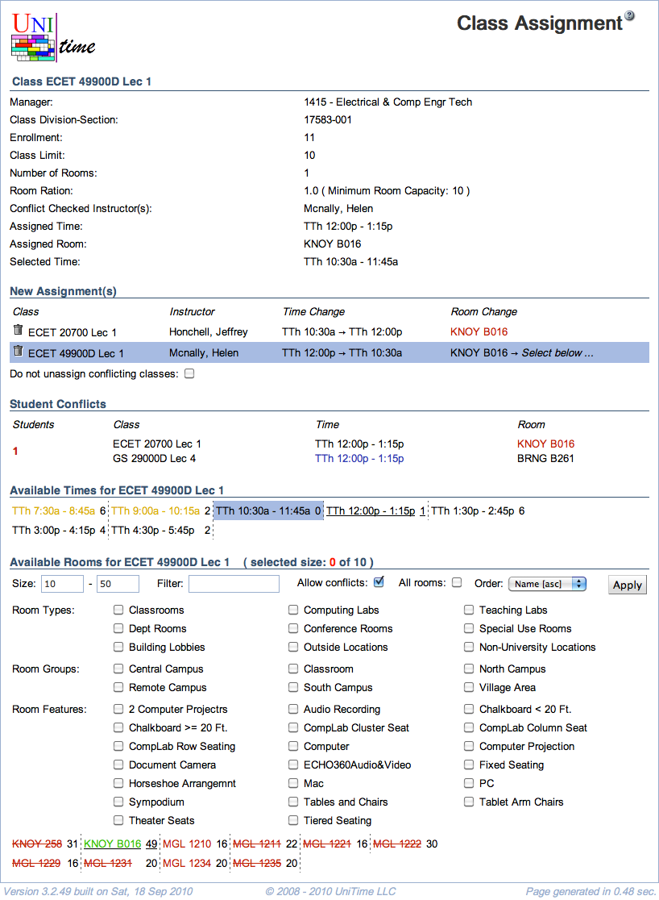

## Screen Description

 The Class Assignment screen provides interface for making changes to the current time and room assignment of a class. The changes can be made here  when no timetable is loaded (as opposed to the screens in the Solver section) since this screen only works with available times/rooms and does not provide suggestions that would include suggested changes of the assignment of other classes. The screen is accessible from the [Class Detail](class-detail) screen in case the department for this class has a committed solution (and no other solution is selected or loaded into the solver).

## Details

 The first section of the screen provides an overview of the class-related information.

* **Manager**
	* Manager responsible for timetabling this class
	* Editable in the [Multiple Class Setup](multiple-class-setup) screen

* **Enrollment**
	* Number of expected students

* **Class Limit**
	* Number of students that should be able to register for a given class
	* Editable in the [Multiple Class Setup](multiple-class-setup) screen

* **Number Of Rooms**
	* Number of rooms needed for a class (usually one)
	* Editable in the [Multiple Class Setup](multiple-class-setup) screen

* **Room Ratio**
	* The ratio of the required room size to the class limit
		* Room Ratio = Room Size / Class Limit
	* In almost all cases, this should be one
	* Some exceptions to the norm
		* You need a room for fewer students than the class limit (Room Ratio is less than one)
		* You need a room for a class with zero limit. In this case, Room Ratio needs to contain the required room size
	* In parenthesis after the room ratio, you can see the minimum room capacity required for this class (for Class Limit <> 0, it is calculated as Room Size = Room Ratio * Class Limit; if Class Limit = 0, then Room Size = Room Ratio)
	* Editable in the [Multiple Class Setup](multiple-class-setup) screen

* **Date Pattern**
	* Days/weeks throughout the semester during which this class will be taught
	* You can click on the icon of the calendar to see which dates belong to the selected date pattern
	* Editable in the [Edit Class](edit-class) screen

* **Conflict Checked Instructor(s)**
	* Names of instructors for whom conflicts should be avoided (such as teaching two classes in different rooms at the same time)

* **Assigned Time**
	* Time assigned in the current committed timetable

* **Assigned Room**
	* Room assigned in the current committed timetable

* **Selected Time**
	* Time selected in the Class Assignment screen

* **Selected Room**
	* Room selected in the Class Assignment screen

## New Assignment(s)

 A list of draft assignments that have been made through this screen. The new assignments are not executed until the **Assign** button is clicked. To remove an assignment from the list of new assignments, click on the **trash bin** at the beginning of the line.

* **Class**
	* Class for which the assignment is about to change

* **Instructor**
	* Instructor for the class

* **Time Change**
	* Self-explanatory

* **Room Change**
	* Self-explanatory

* **Do not unassign conflicting classes**
	* If checked, the conflicting classes stay in the times and rooms where they were and all conflicts need to be resolved manually

## Student Conflicts

 A list of student conflicts caused by new assignments.

* **Students**
	* Number of students for which a given conflict has occurred

* **Class**
	* Classes involved in a conflict

* **Time**
	* Times of classes involved in a conflict (the time from "new assignments" is taken if applicable)

* **Room**
	* Rooms of classes involved in a conflict (the room from "new assignments" is taken if applicable)

## Available Times

 A list of times available for the class that meet the restrictions on required time patterns. Time preferences are color coded in the text color of the times. To select a new time assignment for a class, click on the time.

## Available Rooms

 A list of available rooms for the class. This section is displayed only when time for a class has been selected. "( selected size: X of Y )" next to the section header means that the rooms selected so far have a total of X seats available while the minimum required room capacity is Y.

* **Size**
	* Only rooms with room capacity in this range will be displayed

* **Filter**
	* Enter e.g. a building abbreviation to see only available rooms in a given building
	* Semicolon can be used as logical or. For instance, **a,b;c** will display all rooms containing both **a** and **b** in their names or containing **c** in their names.

* **Allow conflicts**
	* Include rooms that are already used for an examination
	* Such rooms are displayed in red
	* If such room is selected, the New Assignment(s) section of this screen will have a new line with the examination that got unassigned (you can click on that line to find time/room assignment for that examination)

* **All rooms**
	* Allow also rooms from other departments (ignore room sharing)

* **Order**
	* Select order of the rooms displayed in this section

* **Room Types**
	* Limit displayed rooms by room type

* **Room Groups**
	* Limit displayed rooms by room group

* **Room Features**
	* Limit displayed rooms by room feature

 Click **Apply** to apply changes to the list of rooms.

 Click on a room from the list of available rooms to tentatively assign it to the class (and add the assignment to the New Assignment(s) section where it can be confirmed or removed).

{:class='screenshot'}
