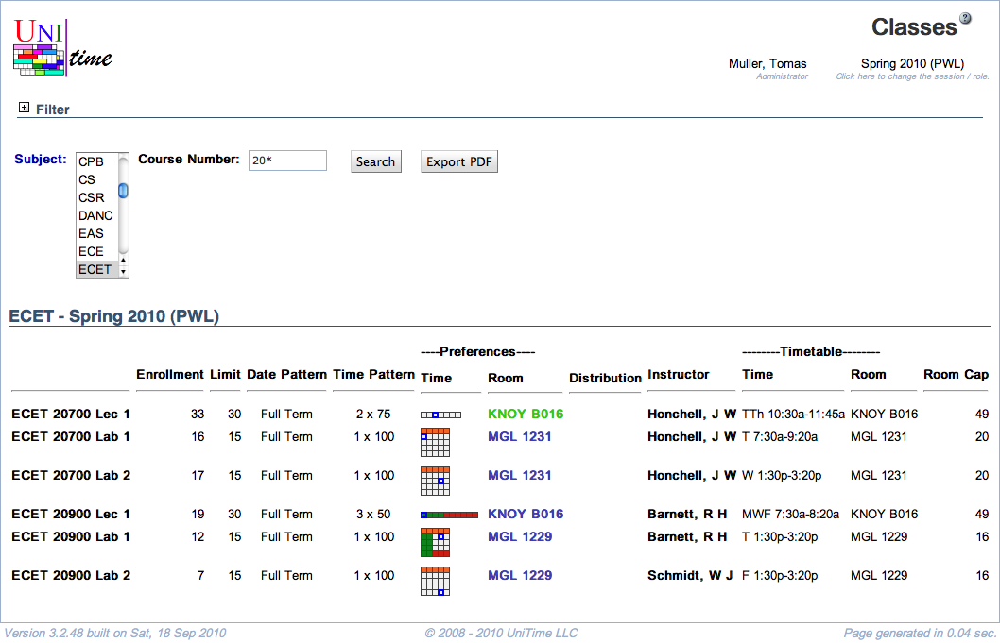
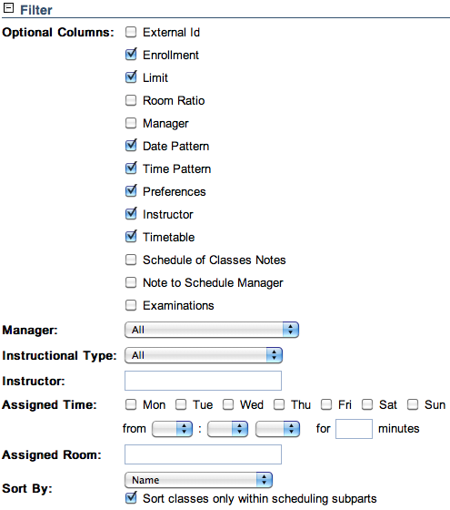

## Screen Description

In the Classes screen you can see a list of classes from your department(s) filtered and sorted based on information that you are interested in. This screen may be used to review preferences for classes.

{:class='screenshot'}

## Filter

In the **Filter**, you can select what kind of classes you want to see and what information to display about each of the classes. You always need to click on the Search button to apply changes you have made to the filter.

{:class='screenshot small'}

* **Optional Columns**
	* Select what information you want to see about each of the classes in the list
	* See the description of the [Instructional Offerings](instructional-offerings) screen for information about what each of these items means

* **Manager**
	* Select a manager to display only classes that are being timetabled by that manager
		* For example, select "Large Lecture Room Manager" to see all of your classes that require a large lecture room; this is useful if you want to print out your LLR preferences for later use (for your reference)

* **Instructional Type**
	* Only classes of the selected instructional type will be displayed in the list

* **Instructor**
	* You can type in the name (or a part of the name) of an instructor to see only the classes that this person has been assigned to

* **Assigned Time**
	* Once a timetable has been created, you can search for classes taught on particular days and/or at particular times

* **Assigned Room**
	* Once a timetable has been created, you can search for classes taught in a particular room
	* You can also enter only a part of the name of the room - for example, only the building abbreviation to see all classes taught in a specific building

* **Sort By**
	* You can sort your list of classes by
		* Name - that is, the course number, the name of the scheduling subpart and the number of the class within the scheduling subpart
		* All the other items are self-explanatory
	* If "Sort classes only within scheduling subparts" is checked (and it is checked by default), the sorting will be performed only within scheduling subparts; otherwise sorting is done on all classes
		* Example: if you want to sort the list of classes by instructor to get a list of teaching assignments together with preferences for those classes, you will want to uncheck this checkbox

* **Cross Lists**
	* If "Show cross-listed classes" is checked, the classes of courses that are cross-listed but are not the controlling courses will also be displayed (within their subject areas)
		* The classes that are cross-listed, but are not a part of the controlling course in the cross-list, will not be in bold letters (as opposed to classes of the controlling courses and the courses that are not cross-listed)
	* If "Show cross-listed classes" is not checked, the courses that are cross-listed but not controlling will not be displayed at all in the list of classes

## Subject Line

* In the **Subject** field, you can select one or more subject areas.
	* If you only have one subject area, this field will be pre-populated for you.
	* To select multiple subject areas, hold the Control (Ctrl) key on your keyboard while clicking on subject areas with your mouse

* You can use the **Course Number** field in several ways
	* Leave it blank and click Search to see all the classes for given subject area(s) and your filter setup
	* Enter the course number of the course that you want to display and click Search to see all its classes (filtered as you wanted)
	* Enter a "wild card", such as "1*" and click Search to display all classes of the 100 level courses. A variation on the use of the wildcard would be to enter "595*" to display classes for 595 and for all 595 suffix courses

* Click the **Search** (Alt+S) button to apply your filter and your selection of the subject area and the course number

* **Export PDF** (Alt+P) exports the list of classes into a PDF document which is then easy to save or print. For more details, see the [Instructional Offerings](instructional-offerings) screen description.

## List of Classes

* Click on any class in this list to get to the [Class Detail](class-detail) screen for that class. In that screen, Previous/Next buttons will navigate you through detail screens of the classes you could see in the Classes screen.

* The list has a separate section for each subject area.
