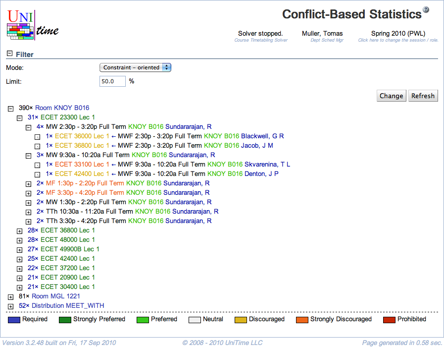

## Screen Description

 The Conflict-Based Statistics screen displays the conflicts created during the solver's attempts to assign possible rooms and times to the class (i.e., other class assignments that were incompatible) and the reasons for these conflicts. These reasons correspond to violations of various constraints on the problem (for example, two classes requiring a single instructor at the same time, or three classes requiring the same time when only two rooms are available). Typically these conflicts are caused by too many classes competing over a fixed resource. The statistics can help point out the constraining resource, or an overly restrictive requirement, so that changes can be made to the input data which allow the problem to be solved.

 **Hint:** To check the feasibility of a problem, you can try to solve it using **Check** configuration first (using [Solver](solver) page). This will ignore all but required or prohibited constraints so that if there is no complete solution due to some inconsistencies in the problem, these will be easier to see in the Conflict-Based Statistics (since classes are competing only for required resources/constraints).

## Details

### Filter

* **Mode**
	* Variable - oriented
		* The upper-most level of each problematic set is the variable (class) whose values (time/room assignments) have been unassigned; the next level are resources and the last one is classes competing over resources with the given class
	* Constraint - oriented
		* The upper-most level of each problematic set is the constraint that causes unassignments (such as "Distribution SAME_ROOM", "Room UNIV 101", etc.)

* **Limit**
	* Percentage of unassignments you want to display (the classes/resources with the largest number of unassignments are displayed first)
	* The limit is applicable to the lower levels too (for example, you will only see classes covering the most important 50% of the problems with a given resource)

### Conflict-based Statistics

 The structure for each mode is as follows

 **Constraint-oriented**

* Constraint
	* Class in the constraint that got unassigned
		* Time, room and instructor for that class
			* The class that caused the unassignment of the unassigned class

 **Variable-oriented**

* Class that got unassigned
	* Time, room, and instructor for that class
		* Constraint
			* Class that caused unassignment due to the constraint

## Operations

* **Change**
	* Apply changes in the filter

* **Refresh**
	* Refresh the screen

{:class='screenshot'}
