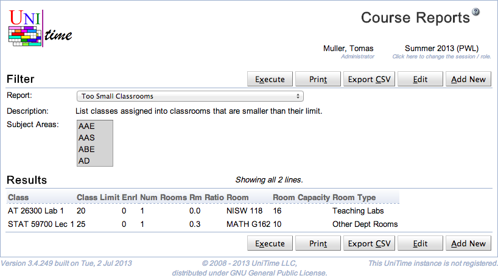

## Screen Description


 Course, Examination, Student Sectioning, Event, and Administration Reports pages are used to create custom reports that are computed using [HQL](http://docs.jboss.org/hibernate/orm/3.3/reference/en/html/queryhql.html) (Hibernate Query Language) to directly query the database. The creation of such reports requires a working knowledge of the UniTime's database structure and the Hibernate model. There is no comprehensive documentation of the database structure at the moment, except of the source code. The Hibernate model (i.e., the *.hbm.xml files in [JavaSource]( https://github.com/UniTime/unitime/tree/master/JavaSource) folder) is a good place to start. Please contact us at [support@unitime.org](mailto:support@unitime.org) if you need a help with development of a particular report.


 An HQL report can have one or more parameters (current academic session, a department, list of subject areas, etc.), which the user can provide in the Filter section. A report can either be accessed directly from the web page or exported to CSV (comma separated values) text file.

## Details


 Each report, based of its nature, can appear on one or more of the reports pages, and requires the appropriate permission to run:

* Course Reports are in the menu under Courses and require HQLReports Courses permission

* Examination Reports are in the menu under Examinations and require HQLReports Examinations permission

* Student Sectioning Reports are in the menu under Students and require HQLReports Students permission

* Event Reports are in the menu under Events and require HQLReports Events permission

* Administration Reports are in the menu under Administration > Academic Sessions and require HQLReports Administration permission


 If there are no course, examination, student sectioning, or event reports, the appropriate Course, Examination, Student Sectioning, or Event Reports page does not appear in the menu. The Administration Reports page always appears in the menu (if the user has the required permissions). This allows administrative users to create new reports where there are none.


 Users with HQLReports Add / Edit / Delete permissions can create new reports, and edit or delete existing reports. Some reports may be also available to administrators despite of their appearance (they require HQLReports Admin Only permission).


 When a report is being created or edited (click **Add New** button or **Edit** when the appropriate report is selected), following dialog appears.


{:class='screenshot'}


{:class='screenshot'}


 A report has a name, a description, a query, and a few flags. The flags control on which page the report will be available and whether it will be available to all users that can open the page (have the appropriate HQLReports permission) or only to administrators (i.e., users with HQLReports Admin Only permission). The query is in the standard [HQL](http://docs.jboss.org/hibernate/orm/3.3/reference/en/html/queryhql.html) format with a few additions:

* The query can be parametrized by the current academic session (of the user working with the page) and / or a selected room(s), building(s), subject area(s), and department(s). See the following section for more details.

* In column names _ translates to a space. The first column can contain a unique id of a class, a scheduling subpart, an instructional offering, a location, an instructor, an examination or an event. This can make each line clickable and leading to the appropriate detail page.

# Parameters


 The parameter %SESSION% is automatically replaced with the unique id of the academic session that the user is working with. If the following parameters are used in the query, the appropriate drop down will appear on the page and the parameter is replaced by the id of the selected item.

* %BUILDING% selection of a building (Building class)

* %ROOM% selection of a room or a non-university location (Location class)

* %DEPARTMENT% selection of a department (Department class)

* %SUBJECT% selection of a subject area (SubjectArea class)

* %PITD% selection of a point in time data snapshot (PointInTimeData class)

* %STUDENT_GROUP% selection of a student group (StudentGroup class)
	* %ACADEMIC_AREA% selection of an academic area of a student (AcademicArea class)
	* %POS_MAJOR% selection of a major of a student (PosMajor class)
	* %ACCOMODATION% selection of an accommodation of a student (StudentAccomodation class)


 If the plural variant of the parameter is used (i.e., %BUILDINGS%, %ROOMS%, %DEPARTMENTS%, or %SUBJECTS%), a multi-select drop down is used and the parameter is replaced by a list of the selected unique ids.  There is no plural for %PITD%, it is only possible to select a single point in time data snapshot.


 If a user has a department dependent role (e.g., departmental schedule manager), only associated departments, subject areas, rooms, and buildings will be available in the drop downs.


 **Example:**
```
from Department d where d.session.uniqueId = %SESSION% and d.uniqueId in %DEPARTMENTS%
```


 Single value parameters (i.e., %SESSION%, %BUILDING%, %ROOM%, %DEPARTMENT%, and %SUBJECT%) are replaced by the unique id of the selected item, multi value parameters (i.e., %BUILDINGS%, %ROOMS%, %DEPARTMENTS%, and %SUBJECTS%) are replaced by a list (id1, id2, ... idn).

## Clickable Lines


 Report lines can be made clickable, leading to the appropriate detail page. To do so, first column must return a unique id with the following label. Such unique id column is not displayed in the report.

* [Class Detail](class-detail) page: first column returns Class_.uniqueId and is named **__Class**

* [Scheduling Subpart Detail](scheduling-subpart-detail) page: first column returns SchedulingSubpart.uniqueId and is named **__Subpart**

* [Instructional Offering Detail](instructional-offering-detail) page: first column returns InstructionalOffering.uniqueId and is named **__Offering**

* [Room Detail](room-detail) page: first column returns Location.uniqueId and is named **__Room**

* [Instructor Detail](instructor-detail) page: first column returns DepartmentalInstructor.uniqueId and is named **__Instructor**

* [Examination Detail](examination-detail) page: first column returns Exam.uniqueId and is named **__Exam**

* [Event Detail](event-detail) page: first column returns Event.uniqueId and is named **__Event**

* Student detail dialog: first column returns Student.uniqueId and is named **__Student**
