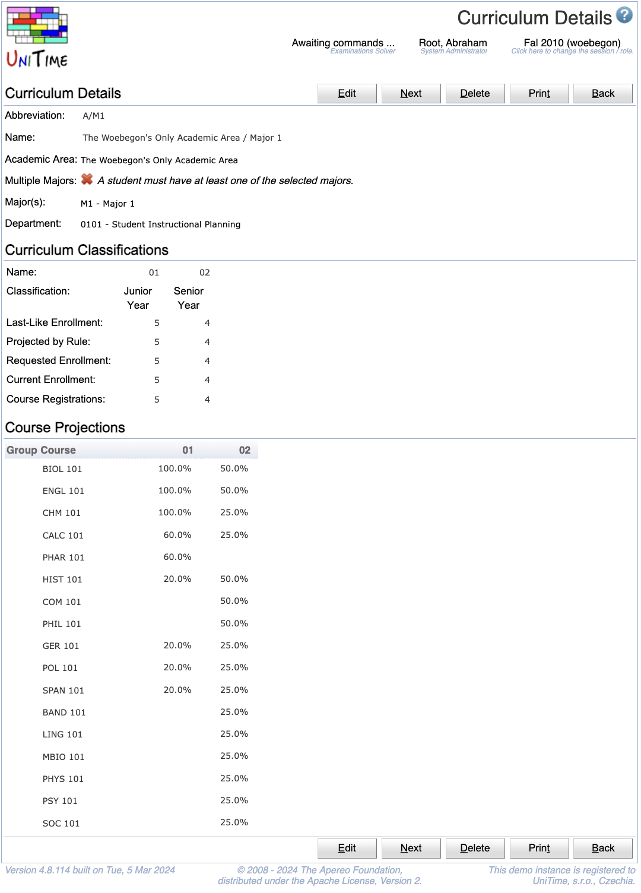

## Screen Description

 The Curriculum Detail screen provides information about an existing curriculum.

## Details

### Curriculum Details

* **Abbreviation**
	* Curriculum abbreviation

* **Name**
	* Name of the curriculum

* **Academic Area**
	* Academic area for which the curriculum is set up (each curriculum can only have one academic area)

* **Major(s)**
	* The major (or more majors) within the selected academic area for which the curriculum is set up 

* **Department**
	* The department whose curriculum managers should be able to edit the curriculum

### Curriculum Classifications

 The curriculum classifications show numbers of students in particular semesters of study, including projected numbers or last-like enrollment.

* **Name**
	* Name of the academic classification, i.e., of the semester in which the students will be

* **Classification**
	* Academic classification

* **Last-Like Enrollment**
	* Number of students from given majors who were enrolled in the courses of this curriculum in the last-like semester

* **Projected by Rule**
	* Number of students as projected in the [Curriculum Projection Rules](curriculum-projection-rules) page (calculated and entered by administrators)

* **Requested Enrollment**
	* Expected number of students in the given classification who will follow this curriculum

* **Current Enrollment**
	* Number of students of this curriculum (i.e., who have the majors from this curriculum) currently enrolled in the courses of this curriculum

 Note: There is an option to Hide empty columns / Show all columns for the table (when applicable - i.e., when there are classifications with no last-like or requested enrollments) - see the bottom right end of the table, the shaded text. Click on the text to perform the task the text describes.

### Course Projections

* **Group**
	* Groups of courses created by the manager of this curriculum (to indicate if the courses have students in common or not)
	* To sort by group
		1. Click on the "Group" column header
		2. In the menu that opens, click on "Sort by Group"

* **Course**
	* Abbreviations of all the courses in the curriculum
	* After clicking on the column header "Course", the following options appear in a menu

* Show Percentages
	* Display percentages of the Requested Enrollment number instead of numbers of students
	* Displayed only when the table shows numbers

* Show Numbers
	* Switch back from percentages to numbers
	* Displayed only when the table shows percentages 

* Show Last-Like Enrollment
	* Show numbers of students from above majors who took the course during the last-like semester

* Show Projection by Rule
	* Show estimated numbers of students derived from projections for majors

* Show Current Enrollment
	* Display the number of students of this curriculum who are enrolled in the course

* Show Empty Courses
	* Display courses with zero students

* Hide Empty Courses
	* Do not display courses with zero students

* Sort by Course
	* Sort the Course Projections table by the course abbreviation (alphabetic order)

* **Academic Classification**
	* For each academic classification, the requested enrollment number is displayed for each course 
	* An academic classification is displayed in the table only if there is a requested enrollment number in the appropriate column in the Curriculum Classification section of this screen
	* After clicking on a header of a column related to an academic classification, a menu appears; the first set of options is described above (in the Course header section); the last option is to sort the Course Projections table by that column

## Operations

* **Edit** (Alt+E)
	* Go to the [Edit Curriculum](edit-curriculum) screen to make changes to this curriculum
	* Displayed only for authorized users

* **Previous** (Alt+P)
	* Go to the Curriculum Detail screen for the previous curriculum

* **Next** (Alt+N)
	* Go to the Curriculum Detail screen for the next curriculum

* **Delete** (Alt+D)
	* Delete the curriculum and go back to the [Curricula](curricula) screen
	* Displayed only for authorized users

* **Print** (Alt+T)
	* Print the Curriculum Detail screen

* **Back** (Alt+B)
	* Go back to the [Curricula](curricula) screen

{:class='screenshot'}
