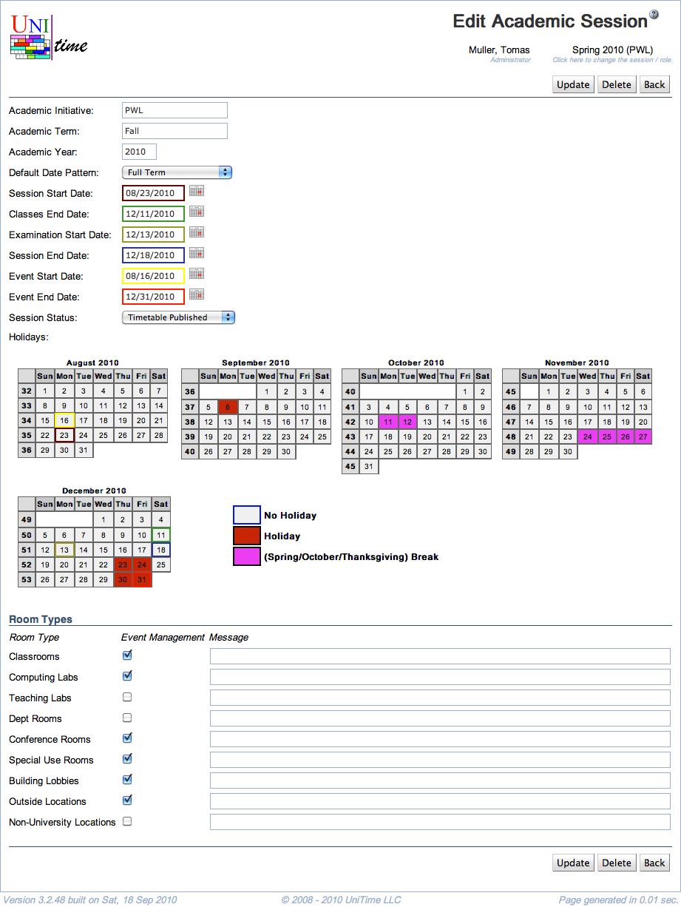

## Screen Description

 The Edit Academic Session screen provides interface for changing properties of an academic session.

## Details

* **Academic Initiative**
	* Name of the academic initiative (for example, a campus within a university)

* **Academic Term**
	* Term (semester) of this academic session

* **Academic Year**
	* Year of this academic session

* **Default Date Pattern**
	* Select which date pattern should be the default one out of all the date patterns available for a given session (you can see the available date patterns in the [Date Patterns](date-patterns) screen when you are in the given academic session)
	* After you create an academic session, you need to create or roll forward date patterns in order to have any date patterns available. To roll forward date patterns, use [Session Roll Forward](https://sites.google.com/a/unitime.org/help/index_php?title=Session_Roll_Forward&action=edit) page.

* **Session Start Date**
	* The date when the session begins

* **Classes End Date**
	* The date when classes end

* **Examination Start Date**
	* First date of final examinations

* **Session End Date**
	* The date when session ends (for example, a session can end after final exams, a week after the classes end)

* **Events Start Date**
	* First date for which events can be entered for this academic session

* **Events End Date**
	* Last date for which events can be entered for this academic session

* **Session Status**
	* The statuses are defined in the [Status Types](status-types) screen

* **Holidays**
	* Indicate holidays and breaks within the academic session by clicking on the colored squares in legend and then on dates in the calendar (classes are not held on these days)

### Room Types

 In the Room Types section it can be selected which types of rooms (locations) can be used for event management. The locations that should be used still need to be controlled by a department that has an event manager associated with it, otherwise they cannot be used.

* **Room Type**
	* Room type - one of the types defined in the [Room Types](room-types) administrative screen

* **Event Management**
	* If the checkbox is checked, the appropriate room type can be used in event management

* **Message**
	* Not in use at the moment

## Operations

* **Update**
	* Save changes and go back to the [Academic Sessions](academic-sessions) screen

* **Delete**
	* Delete the academic session go back to the [Academic Sessions](academic-sessions) screen
	* There always has to be at least one academic session left. It is not allowed to delete the currently selected academic session.
	* Please note that you need to change the status of the academic session to Session Finished first as active sessions cannot be deleted.

* **Back**
	* Go back to the [Academic Sessions](academic-sessions) screen without saving anything

{:class='screenshot'}
