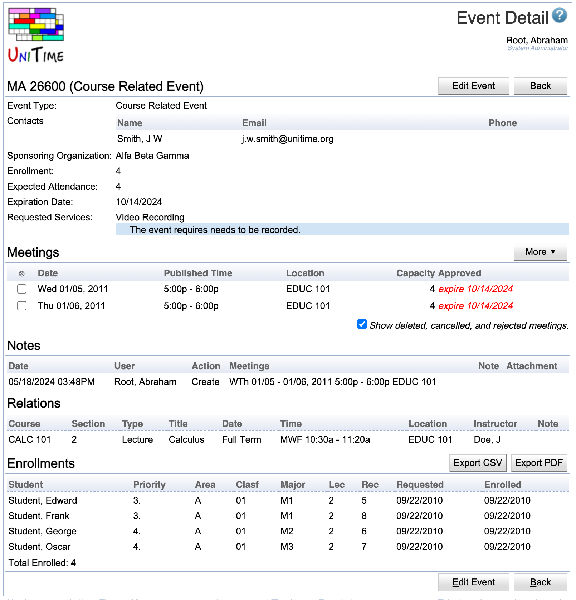
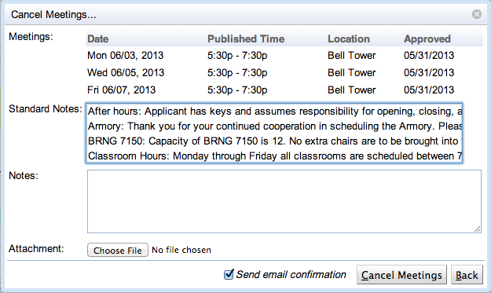

## Screen Description

 The Event Detail screen provides an overview of an event and its meetings. If allowed, an event can be edited (e.g., new meetings can be added), approved, rejected, or cancelled from this page. Course related, class, and examination events also show additional information about their related objects (classes and courses), enrolled students and their conflicts. Event detail page can be reached from [Events](events) or [Event Room Availability](event-room-availability) page by clicking on the appropriate event.

 Event detail page can be reached by the owner of the event (i.e., the main contact), anyone from the additional contacts, or an event manager (i.e., a person that can change approval status of at least one meeting of the event). Details of class and examination events can be also seen by course coordinator for the course (or courses) involved, schedule managers (if there is a class / course of the subject area that the manager controls) or examination managers (for examination events).

 Besides of the event type, contact information and some additional properties that are filled in (like sponsoring organization or expected attendance), the Event Detail page contains the list of its meetings. Each meeting consists of a date, time, and a room where the meeting takes place. There is also the approval status which starts as pending (when an event is requested, but not yet approved). Approved meetings show with they approval date (the date when the meeting was approved). Cancelled and rejected meetings can be also included in the list when the "Show deleted, cancelled, and rejected meetings." toggle is checked.

 The Notes section contains a history of operations that were done to the event. Each operation contains a time stamp, a name of the user who made the change, a list of meetings that where affected (if applicable), a note, and an attachement (if there was a file attached to an event request, an update or approval / inquiry / cancellation / rejection of some of the meetings of the event).

 Class, examination, and course related events also have a **Relations** section, which contain some basic information about the related class (for class event), examination (for examination event), or a list of classes, configurations, course or instructional offerings (course related event, or an examination event). If the user has permissions to open the appropriate [Class Detail](class-detail), [Instructional Offering Detail](instructional-offering-detail), or [Examination Detail](examination-detail) page, the line is clickable and leads to the appropriate detail page.

{:class='screenshot'}

{:class='screenshot'}

 These events (class, examination, and course related events) also have **Enrollments** section which contains a list of all students enrolled to the related classes, configurations, course or instructional offerings. If some of the students have a time conflict between the displayed event and some other events they have (classes, exams, or approved course-related events that require attendance), the conflicts are also displayed in the table.

{:class='screenshot'}

## Edit Event

 If allowed, an event can be edited by clicking on the **Edit Event** button. This includes the ability to add new meetings, modify existing meetings, change event properties (like the contacts or its sponsoring organization), delete or cancel some or all of its meetings. The button leads on the [Edit Event](edit-event) page. Please note, that it is generally not allowed to delete / cancel a meeting that already happend (the meeting date is before today), request a past meeting, or modify an event if all the dates of the academic session are in the past. Some additional restrictions may apply from the user's permissions. It could be, for instance, allowed for course coordinators, schedule deputies, and/or examination managers to cancel or modify a class or examination event.

## Approval

 A selected subset of the event's meetings or all meetings (when no meeting is selected) can be approved, cancelled, rejected or inquired upon by an event manager. To do so, select the appropriate operation under the **More** button. The appropriate Approve Meetings..., Cancel Meetings..., Reject Meetings..., or Inquiry... dialog will appear. Here a note can be entered (e.g., explaining the reason for the rejection). It can be either typed in, or one (or more) of the standard notes can be selected by double clicking on the note. Double clicking on a standard note will copy the note into the Notes text area (at the end of it, if there is already something in). It is also possible to attach a file (e.g., a PDF form that needs to be filled in or some other instructions). The file will be attached to the event confirmation email and it will be also available in the Notes section of the event.

{:class='screenshot'}

 Usually, a pending event can be either approved, rejected, or cancelled. Once approved, a meeting can be only cancelled. An event manager can only approve, reject, or cancel meetings of the rooms that are managed by one of his/her department. It is possible that an event may required multiple approvals (of different event managers) if it is requesting meetings in rooms of different departments (e.g., a centrally managed classroom and a departmental conference room).

## Operations

* **Edit Event** (Alt+E)
	* Go to the [Edit Event](edit-event) screen to change information about the event (but not meetings)
		* Only available for Event Manager, Administrator, or Main Contact

* **Previous** (Alt+P)
	* Go to the Event Detail screen for the event that was before the current one in the [Events](events) screen

* **Next** (Alt+N)
	* Go to the Event Detail screen for the event that was after the current one in the [Events](events) screen

* **Back** (Alt+B)

* Go back to the previous screen

## Approval Workflow & Permissions

* Requested meeting is in a pending state.
	* A requested meeting may be approved automatically when requested by an event manager with the Event Location Approve permission if in a room of the event department of the manager and the More > Approve New Meetings toggle is checked.

* Pending meeting can be approved, rejected (Event Meeting Approve permission), cancelled (Event Meeting Cancel permission), or inquired (Event Meeting Inquire permission) by an event manager.

* Pending meeting can be deleted (Event Meeting Delete permission) or cancelled (Event Meeting Cancel permission) by the requestor or an event manager.

* Approved meeting cannot be deleted or rejected, it can only be cancelled (by the requester or an event manager).

* Cancelled and rejected meetings are kept in the database, but their status can no longer be changed.
	* Deleted meetings are also deleted from the database. If all meetings of an event are deleted, the event is deleted as well.

* Cancelled and rejected meetings are only visible on the Event Detail and Edit Event page, and on the Events page with the following Event Filter settings:
	* Mode: Cancelled / Rejected
	* Mode: My Events
	* Requested By: ...

* Meetings in the past can be requested or deleted only with the Event Edit Past permission. They can be approved, rejected, or cancelled only with the Event Approve Past permission.

* Events in a room that is not managed in UniTime (it does not have an event department defined) can be only requested by a user with permission Event Any Location.

* Rooms can be overbooked only by a user with the Event Location Overbook permission (for an event manager the room also has to be from the appropriate event department).

* Special events can be requested by someone with Event Add Special permission, course related events by Event Add Course Related and unavailabilities by Event Add Unavailable.

* Users with Event Set Expiration permission can set event expiration date.
	* All pending meetings will get automatically cancelled on midnight after the expiration date.

* Class events can be edited with Event Edit Class permission (e.g., course coordinators or schedule managers may be given such permission) or some or all of its meetings can be cancelled with Event Meeting Cancel Class permission. There is also Event Meeting Inquire Class permission that allows sending inquiries about the class event.

* Examination events can be edited with Event Edit Exam permission (e.g., examination managers may be given such permission) or some or all of its meetings can be cancelled with Event Meeting Cancel Exam permission. There is also Event Meeting Inquire Exam permission that allows sending inquiries about the examination event.
