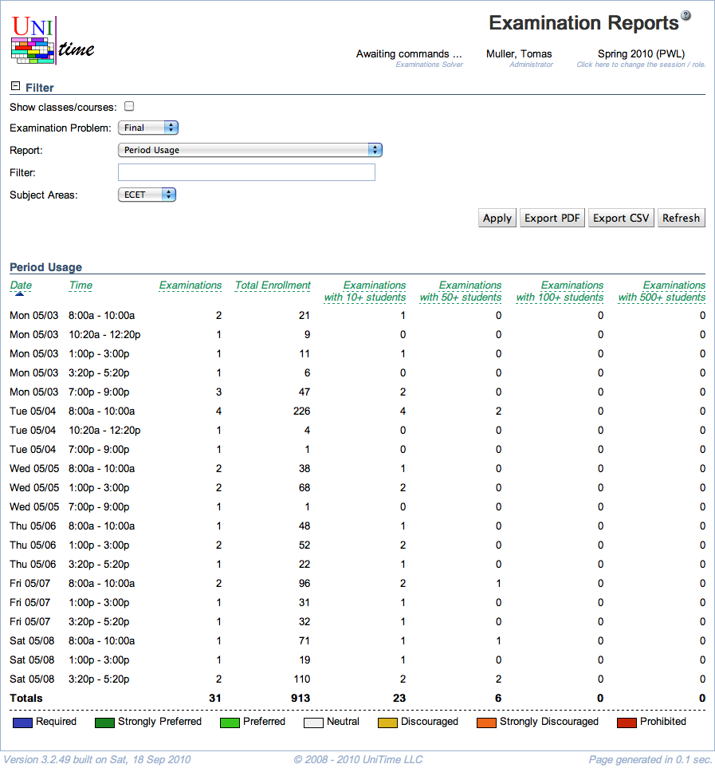

## Screen Description

In the Examination Reports screen, the user can view and export a report created from examination data either for a selected subject area or for all subject areas at once.

{:class='screenshot'}

The user can click on any examination to get to its [Examination Detail](examination-detail) screen (and from there for example to the [Examination Assignment](examination-assignment) screen to make changes if needed).

There is another screen, [Examination PDF Reports](examination-pdf-reports), which provides interface for sending PDF reports to any users of the application (and any other email addresses too), so the examination timetabling manager does not need to generate and send reports via emails "manually" in this Examination Reports screen.

## Filter

* **Show classes/courses**
	* Show classes/courses instead of examinations
		* When checked, classes/courses that have an examination are listed
		* When unchecked, the examination is listed

* **Examination Problem**
	* Midterm or Final - set of examinations for which you need the report to be generated

* **Report**
	* Select a report from the drop down list

* **Filter**
	* A text filter for data to be displayed
	* In most reports, the filter is applied for the examination names or - if the "Show classes/courses" checkbox is checked - for the classes/courses whose students have to take the examination
		* There are exceptions, such as in the Room Assignment Report, the filter is applied to the Room column; or, in reports for instructors/students, an ID or student/instructor name may be entered
	* Hint: use comma for conjunctions, semicolon for disjunctions, e.g., 'a,b;c' means '(a and b) or c'

* **Subject Areas**
	* A drop down list of subject areas with an option to select all of them
	* If you need to select a few subject areas, you can use the filter for that - for example, to select PTGS and SPAN, type "ptgs; span" in the filter (without the quotation marks)

## Report

Report selected in the filter. The reports currently available are

1. Exam Assignment Report
	* Name of an examination (or classes/courses for which the examination is held) and time/room assignment together with details such as room capacity and seating type
2. Room Assignment Report
	* For each room that has at least one examination in it, there is a list of dates, times and examination names for examinations that take place there
3. Period Usage
	* For each examination period, there is a number of classes/courses whose students take an examination during that period and the total size of these classes/courses
4. Number of Exams A Day
	* For each examination date, there is a number of students taking 0, 1, 2, 3 or more examinations that day
5. Room Splits
	* A list of examinations that will have more than one room together with the rooms into which they are split
6. Violated Distribution Constraints
	* Distribution Constraints that haven't been met in this examination timetable
7. Direct Student Conflicts
	* A list of classes/courses that have students in common but their examinations overlap in time
8. More Than 2 Exams A Day Student Conflicts
	* Each line contains three or more examinations held on the same day that all have at least one student in common (the student then has more than two examinations on the same day)
9. Back-To-Back Student Conflicts
	* Pairs of examinations that are held back to back and have students in common
10. Individual Student Schedule
	* For each student, there is a list of examinations that the student should take with their period/room assignments
11. Individual Student Conflicts
	* For each student who has a conflict, there is the student listed, the type of his/her conflict and the examinations that are in conflict
12. Individual Direct Student Conflicts
	* For each student who has overlapping examinations, there is the student listed and his/her examinations that overlap
13. Individual More Than 2 Exams A Day Student Conflicts
	* List of students who have more than two examinations on a day, together with the problematic examinations
14. Individual Back-To-Back Student Conflicts
	* List of students who have back to back examinations, together with the examinations (and their period/room assignments)
15. Direct Instructor Conflicts
	* Same as for students
16. More Than 2 Exams A Day Instructor Conflicts
	* Same as for students
17. Back-To-Back Instructor Conflicts
	* Same as for students
18. Individual Instructor Schedule
	* Same as for students
19. Individual Instructor Conflicts
	* Same as for students
20. Individual Direct Instructor Conflicts
	* Same as for students
21. Individual Back-To-Back Instructor Conflicts
	* Same as for students
22. Individual More Than 2 Exams A Day Instructor Conflicts
	* Same as for students

## Operations

* **Apply**
	* Apply the filter (display a report that reflects the selected criteria)

* **Export PDF**
	* Generate a PDF document with the report

* **Export CSV**
	* Export the report into a CSV (comma separated values) document which can be further processed e.g. in Microsoft Excel

* **Refresh**
	* Refresh the screen
