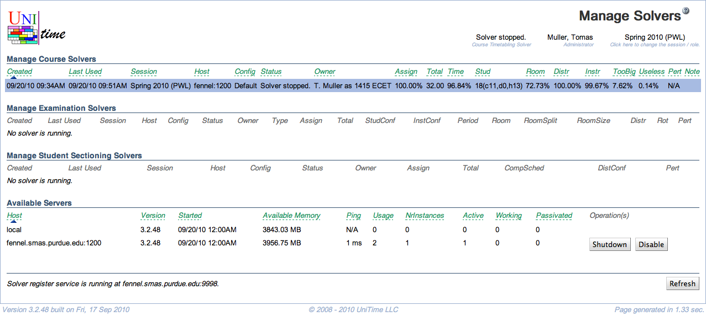

## Screen Description

The Manage Solvers screen provides an overview of all running solvers and servers available for running the solvers. The administrator can also access any of the running solvers and work with it the same way as the user who started it.

## Details

### Manage Solvers

Each line in the Manage Solvers section corresponds to one solver running. The "Owner" is in most cases the schedule manager logged on to the application. If the solver was started by an administrator in disguise - if the administrator switched to a different user using Chameleon - that different user is shown here.

An administrator can click on any of the solvers and then he/she will see information in the Timetables section of the application as if he/she was the user running the solver (the administrator can then also make changes to the timetable, save, unload, etc.).

For each solver, the following operation is available

* **Unload**
	* Unload the solver from the memory; the timetable will not be saved, unless it has been saved before

Note: Each user can have only one solver instance created at a time.

### Available Servers

A list of servers. The columns in the list are

* **Host**
	* Name of the server

* **Version**
	* Version of the application on the server

* **Started**
	* Date and time when the server was started

* **Available Memory**
	* Memory available for the solvers

* **Ping**
	* Response time

* **Usage**
	* Usage = Number of Instances + Active + Working (+ 1000 if disabled)
	* Used for selecting which server to use for a new solver: From servers that have at least 200MB of memory the one with lowest usage is selected.

* **Number of Instances** (NrInstances)
	* Number of solvers in the Manage Solvers list

* **Active**
	* Number of active solvers (i.e., solver instances stored in memory)

* **Working**
	* Number of solvers actively searching for a solution

* **Passivated**
	* Number of passivated solvers
	* A solver instance is passivated when it has not been used for 30 minutes. In this state, the instance is removed from memory and stored on disk. It is automatically activated (brought back into memory) when the solver instance is accessed.

For each server, the following operations are available

* **Shutdown**
	* Shut down the server
	* When a server is shutdown, all instances are stored on disk so once it is started again, those instances are restored and can be used again.

* **Disable**
	* Do not allow any new solvers to start running on this server
		* This is done by adding 1000 to the Usage number

## Operations

* **Deselect**
	* Deselect the solver that you have selected in the Manage Solvers list
		* This makes it possible to switch back to work that you want to do as yourself, not as somebody else running the solver

* **Refresh**
	* Refresh this screen

{:class='screenshot'}
