### Table of Contents
{:.no_toc}
* table
{:toc}

# Event Manager Administrative Tasks in UniTime 4

UniTime 4 includes the following capabilities for Event Managers:

* Ability to create, edit, send inquiries about and approve events in the rooms they manage.

* Ability to turn on/off event functionality for the rooms they manage.

* Ability to place notes on rooms that are displayed to users whenever they look at a room.

* Ability to manage who can request events in their rooms.

* Ability to create department specific standard notes that are only visible to Event Managers of the specific department.

* Ability to mark standard unavailable times on rooms during which only Event Managers can request events.

* Ability to create department specific Service Providers that can be associated with rooms managed by the Event Manager

These capabilities give Event Managers fine grained control over the rooms they manage.

# Managing Room Event Status Functionality

Event Statuses allow managers to control which rooms are available for users to approve and also restrict the set of users who can request events in a room.

The first step an event manager must take is to switch to the academic session in which they wish to manage their rooms.  To do this the Event Manager must click the current session in the upper right hand corner of the screen.

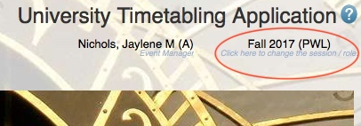{:class='screenshot'}

This will bring up the “**Select User Role**” page.

{:class='screenshot'}

The Event Manager selects the academic session for which they wish to manage their rooms.  This will update the session displayed in the upper right hand corner of the screen.

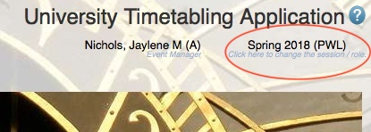{:class='screenshot'}

## **Event Statuses Page**

Event Managers control the availability of their rooms for event management though the **“Event** **Statuses”** page which is accessed through a menu item under the Administration -> Academic Sessions tab.

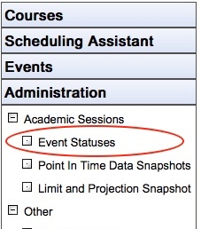{:class='screenshot'}

On the “**Event Statuses**” page you can manage your rooms at the room type level, the individual room level or both.  The page lists the default status, notes, optional services, and break times for each room type for the departments an Event Manager controls.  The page starts by showing a list of room types and the event management status for the room types.

To see the event management status for the individual rooms of a room type the Event Manager can click the + icon next to each room type and it will expand to show the rooms.

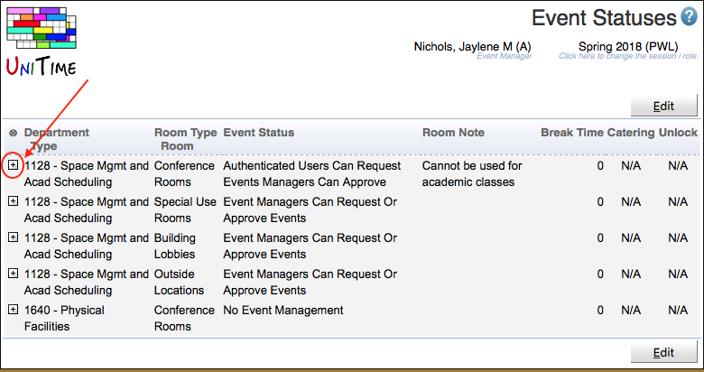{:class='screenshot'}

A room’s event management status data is blank unless it is different than the data defined on the room type.

Optional services that may be assigned to a room are listed at the right of the table.  If the service is available for the room, a checkmark exists in the column associated with the service.  The list of available services can be managed on the Administration -> Other -> Service Providers page.

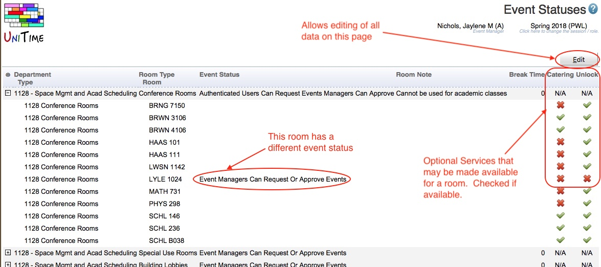{:class='screenshot'}

An Event Manager can edit all information for the room types and rooms on this page by clicking the “**Edit**” button.

## **Edit Event Statuses**

On the “**Edit Event Statuses**” page the Event Manager can do the following:

* Set whether the room type or room can be scheduled for events and if so, who can request events.  

* Set a note at the room type or room level.  The note will be displayed whenever a user mouses over a room in the Events system.

* Set the default break time for a room type or room.  For example:  If a break time of 10 minutes is entered, if a user reserves a room from 8:30 am to 9:30 am, then the room will be reserved from 8:30 am to 9:30 am but the event will list the meeting time as being from 8:30 am to 9:20 am.  This can be used to help users understand they need to be out of their meeting room before the start time of the next meeting in that room.

* Mark whether a service is available for a specific room.

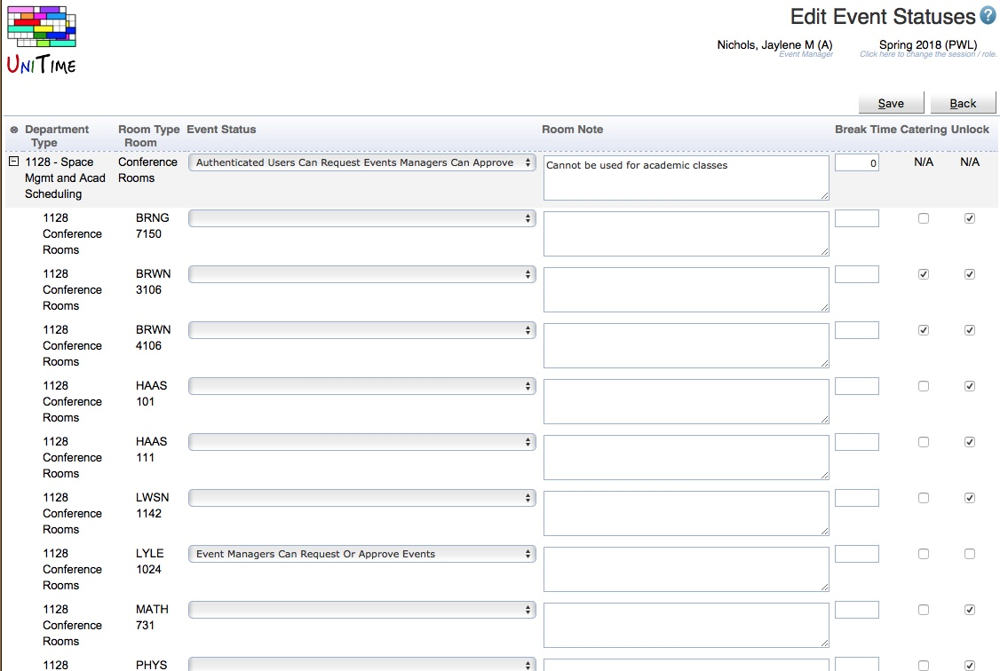{:class='screenshot'}

## **More on Event Statuses**

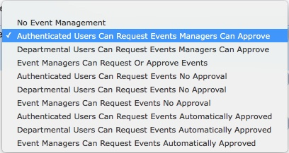{:class='screenshot'}

The event status can be set to one of the following:

* ***No Event Management***
	* Event management is disabled.

* ***Authenticated Users Can Request Events Managers Can Approve***
	* Any authenticated user can request an event, event managers are allowed to approve an event.

* ***Departmental Users Can Request Events Managers Can Approve***
	* Any instructor or timetable manager can request an event in a room of her/his department(s), event managers are allowed to approve an event.

* ***Event Managers Can Request Events Managers Can Approve***
	* Only event managers are allowed to request and to approve an event.

* ***Authenticated Users Can Request Events No Approval***
	* Any authenticated user can request an event, event managers are not allowed to approve an event.

* ***Departmental Users Can Request Events No Approval***
	* Any instructor or timetable manager can request an event in a room of her/his department(s), event managers are not allowed to approve an event.

* ***Event Managers Can Request Events No Approval***
	* Only event managers are allowed to request an event, event managers are not allowed to approve an event.

* ***Authenticated Users Can Request Events Automatically Approved***
	* Any authenticated user can request an event, the event is automatically approved.

* ***Departmental Users Can Request Events Automatically Approved***
	* Any instructor or timetable manager can request an event in a room of her/his department(s), the event is automatically approved.

* ***Event Managers Can Request Events Automatically Approved***
	* Only event managers are allowed to request and event, the event is automatically approved.

If an Event Manager selects a single room or room type in the Event Statuses list, they are taken to a screen where they can edit the data for an individual room or room type.

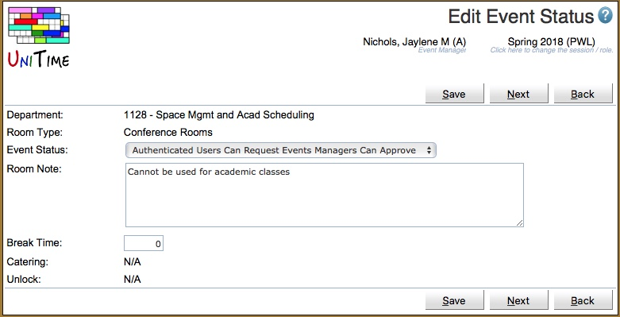{:class='screenshot'}

This page allows the Event Manager to edit the same data that can be edited on the list page.

# Service Providers

Service Providers can be created at a global or departmental level.  Service providers give a way to automatically notify a service provider that an event requires a specific service to occur at the time the event is approved and also automatically notify the service provider if the event has been canceled.

Each Event Manager can create their own service providers  that are specific to their department or an Administrator can create a service provider that can be made available for all departments to use.  To do this the Event Manager can go to the “**Service Provider**” page found under the Administration -> Other tab.

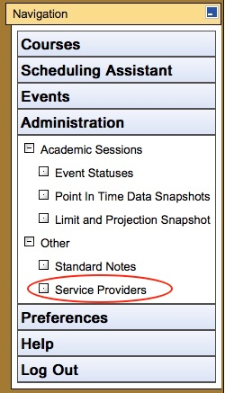{:class='screenshot'}

On the “**Event Service Providers**” page the Event Managers will see a list of the service providers for their departments plus the global service providers.

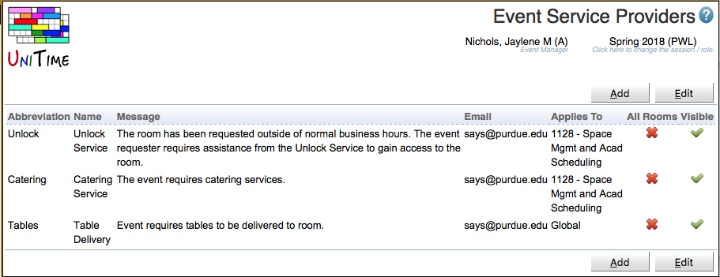{:class='screenshot'}

An Event Manager can add a new service provider for their departments by clicking the “**Add**” button.

On the “**Add Event Service Provider**” page the Event Manager can enter information about the service including a note that will be displayed to the event requestor providing more information about the service, the email address that will receive the event approvals/cancellations, select which of their departments the service applies to and whether the service applies to every room managed in the department or only selected rooms.

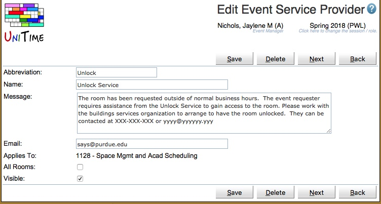{:class='screenshot'}

On the “**Event Service Providers**” page the Event Manager can click the “**Edit**” button and edit all of their departmental service providers at one time.

{:class='screenshot'}

# **Department Specific Standard Notes**

Each Event Manager can now create standard notes that are specific to their department.  To do this the Event Manager can go to the “**Standard Notes**” page found under the Administration -> Other tab.

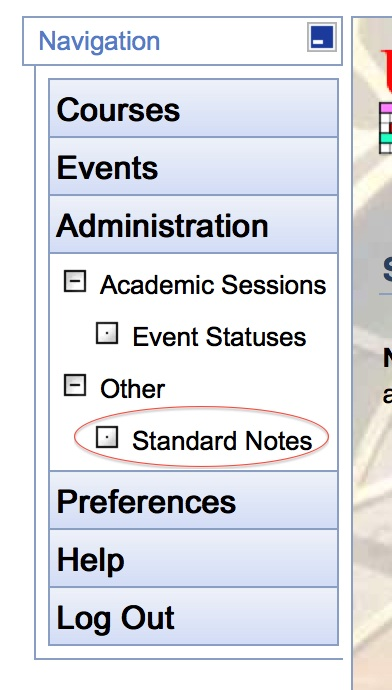{:class='screenshot'}

On the “**Standard Notes**” page the Event Managers will see a list of the notes for their departments plus the global notes.

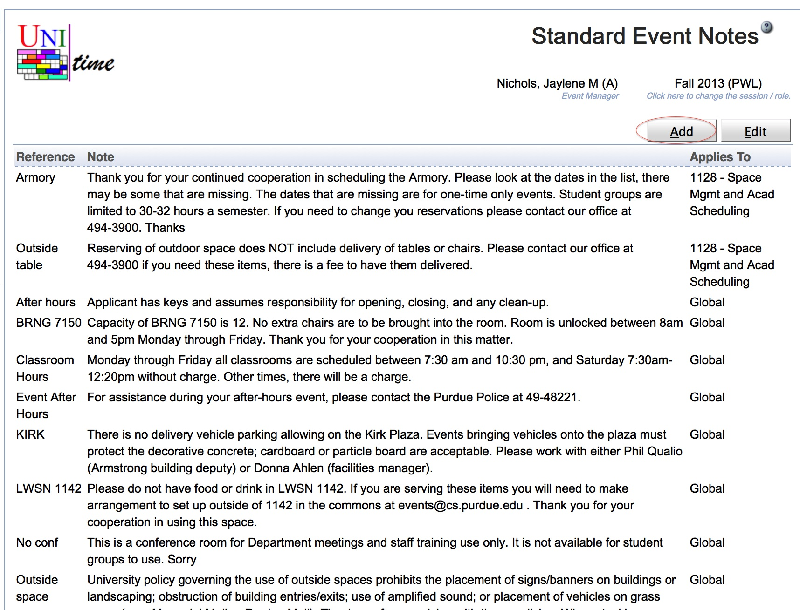{:class='screenshot'}

An Event Manager can add a new standard event note for their departments by clicking the “**Add**” button.

On the “**Add Standard Event Note**” page the Event Manager can enter the note and select which of their departments the note applies to.

{:class='screenshot'}

On the “**Standard Event Notes**” page the Event Manager can click the “**Edit**” button and edit all of their standard notes at one time.

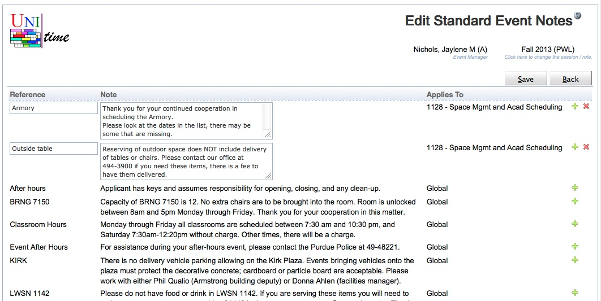{:class='screenshot'}

# Controlling the Times a Room is Available for Events

It is a common use case to have an event room that is not available for events all day every day. It is also a common use case for an Event Manager to need to schedule an event in an event room during the window of time the room is closed.  UniTime supports the ability for an event manager to control the times a room is available for events.  During the windows of time a room is not available for events only the event manager of the room can schedule events in that room.

An Event Manager can control the times for which a user can request an event in a room.  This is done through the “**Rooms**” page found under the Events tab.

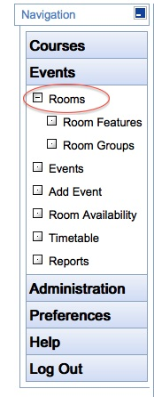{:class='screenshot'}

The Rooms page lists the rooms an Event Manager controls.  By clicking on a room in the list the Event Manager can go to the detail page for the room.

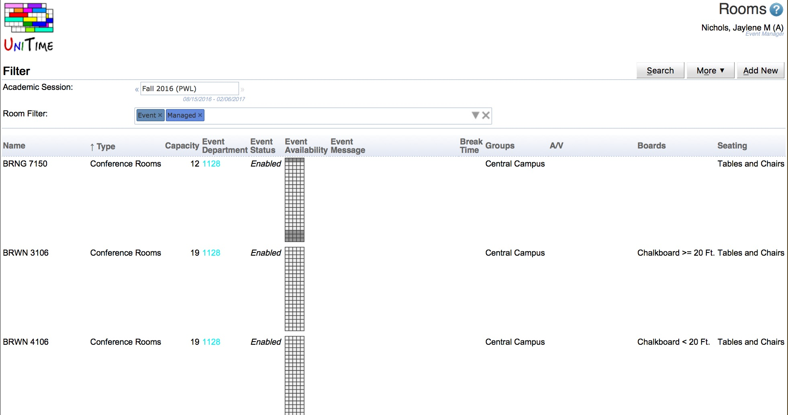{:class='screenshot'}

The “**Room Detail**” page provides the Event Manager with all of the information about the room.  If the Event Manager clicks the “**Edit Room**” button, they are taken to a page where they can configure the default hours of operation for the room, manage the note, and add pictures for the room among other things.

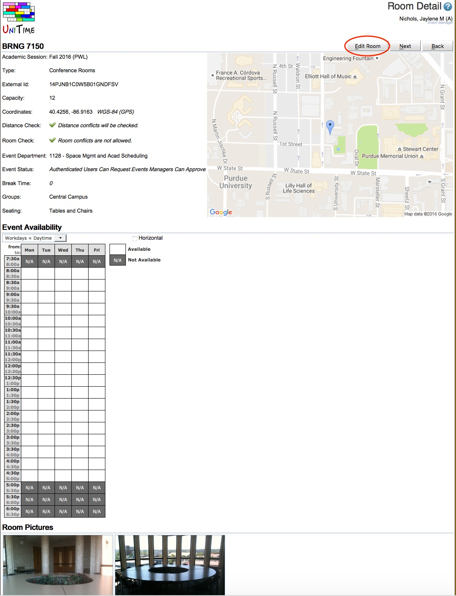{:class='screenshot'}

On the “**Edit Room**” page the Event Manager is presented with a grid that can be used to set the times the room is not available.  It is recommended that when working with this grid the Event Manager set the view to “**All Week x All Times**” in order to be able to manage the entire time a room could be reserved.

{:class='screenshot'}

It is a good practice to enter an “Event Message” that describes the closure window and who to contact to request to reserve the room. This provides users with a valid need to reserve the room outside of its open window the ability to contact the Event Manager.

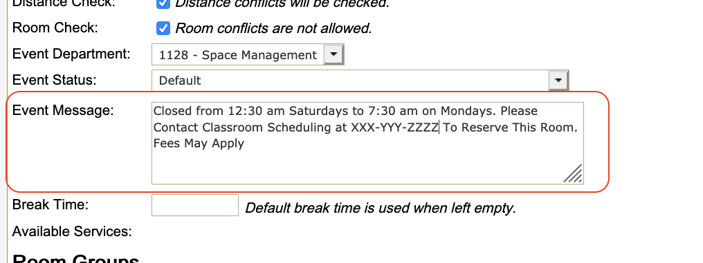{:class='screenshot'}

It is possible for an Event Manager for a room to apply the changes made to a room to multiple future academic sessions as part of a single edit.  To do this the Event Manager should scroll to the bottom of the Edit Room page and select the future academic sessions to update in addition to the current session.  The Event Manager can also select the data to update.  When the Event Manager presses the ‘Update Room’ button the changes will be made to the currently selected academic session and any future academic sessions the Event Manager selected.

{:class='screenshot'}

# Managing Departmental Users

When room types or rooms are restricted only to Departmental Users for event requests, the list of users who can request the rooms is the list of instructors for the department.  Event Managers can use the Instructors page under the Courses -> Input Data tab.

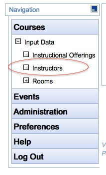{:class='screenshot'}

This takes the Event Manager screen to the Instructor list page for their department.  If the Event Manager manages rooms for more than one department they can select which department to view.

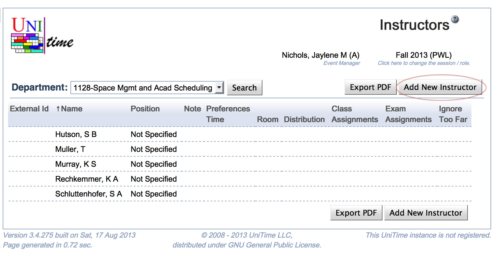{:class='screenshot'}

To add a new person to the list of users for a department the Event Manager can click the “**Add New Instructor**” button.

## **Add New Instructor**

To add a person to the departmental list of instructors to allow them to request events in rooms restricted to the Event Managers department for a session, the Event Manager must add the person as an instructor for their department.  The “**Lookup**” button allows the Event Manager to use the “**People Lookup**” search for the person they wish to add.

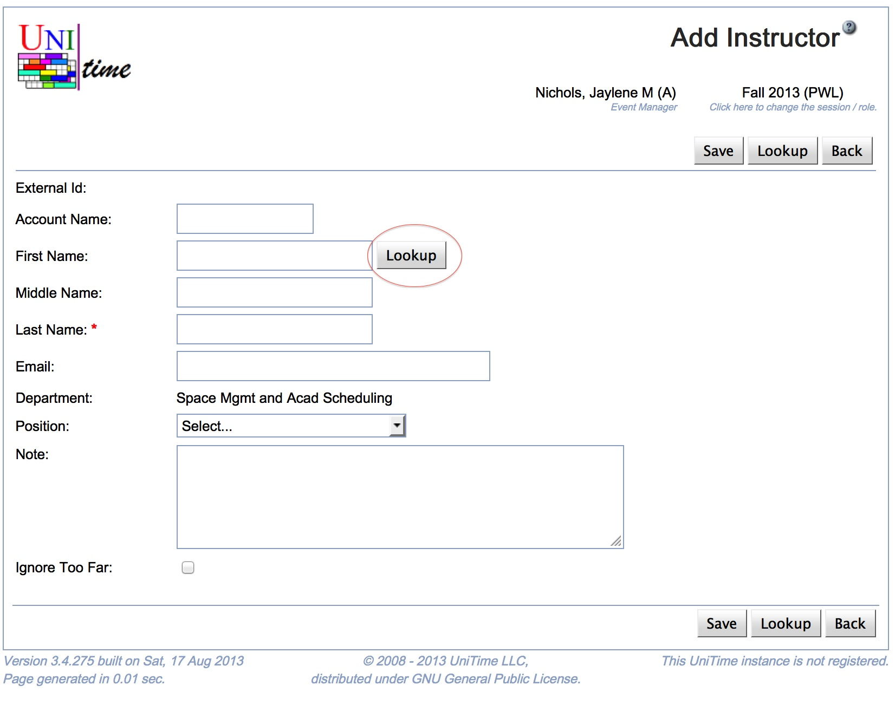{:class='screenshot'}

The “**People Lookup**” popup allows the Event Manager to search for the person they wish to add and when it returns it populates the Add Instructor page with all of the data required to add a person as an instructor for the department.

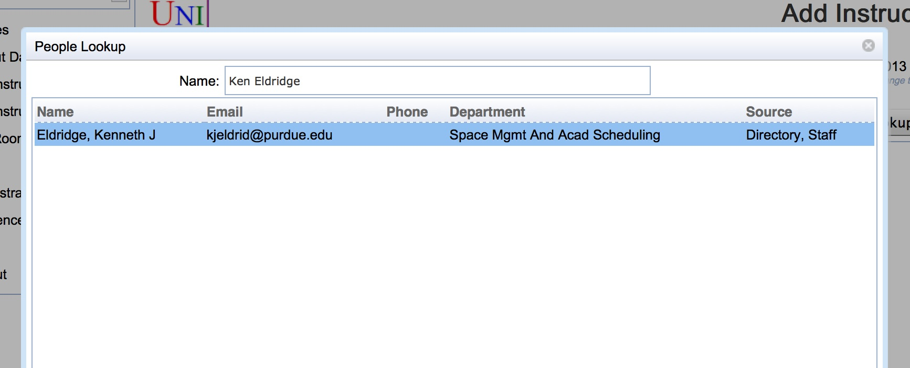{:class='screenshot'}

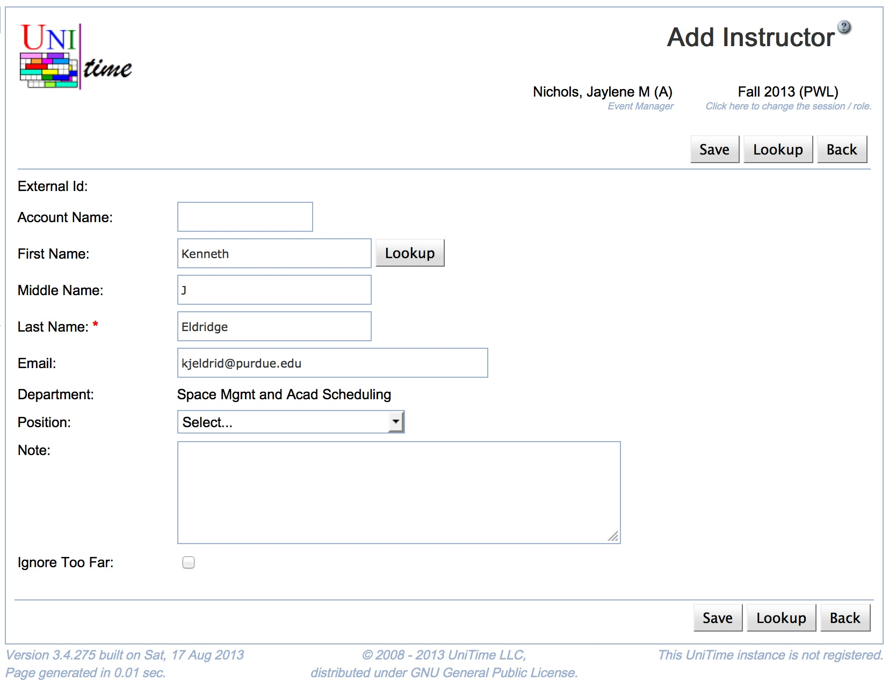{:class='screenshot'}

## **Removing a Person from the Departmental List of Instructors**

The Event Manager can remove a user’s ability to request events in rooms restricted to a department for a session by removing the user from the Instructor list for their department.  To do this the Event Manager must first go to the “**Instructor Detail**” page by clicking the name of the person they wish to remove from the list on the “**Instructors**” page.  On the “**Instructor Detail**” page the Event Manager needs to click the “**Edit Instructor Information**” button to get to the “**Edit Instructor**” page which allows them to delete the record.

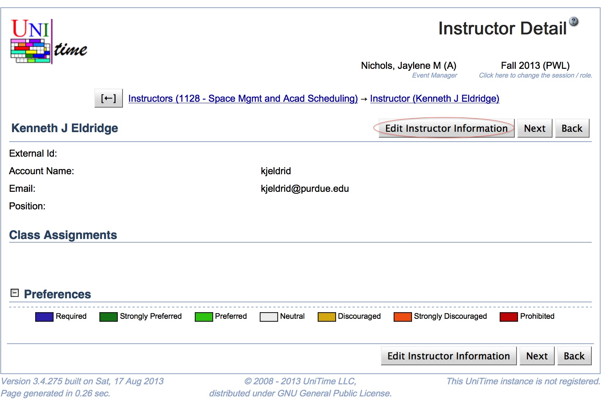{:class='screenshot'}

Once on the “**Edit Instructor**” page, the Event manager can either update the person’s information or click the “**Delete**” button to remove the person from their list.

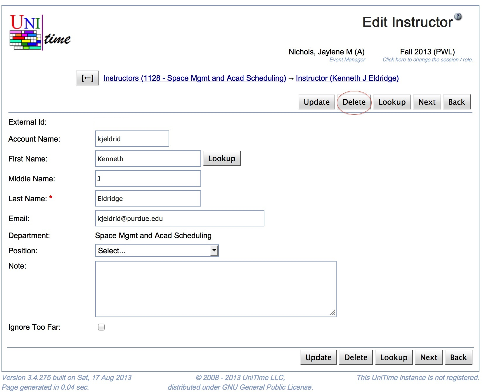{:class='screenshot'}

