### Table of Contents
{:.no_toc}
* table
{:toc}


# 1. Install Oracle Java 9


Download Java 9 JDK from [http://www.oracle.com/technetwork/java/javase/downloads](http://www.oracle.com/technetwork/java/javase/downloads) (a file named like `jdk-9.0.4_osx-x64_bin.dmg`), start it up and follow the installation instructions


{:class='screenshot'}


Double click the package icon


{:class='screenshot'}


Click Continue


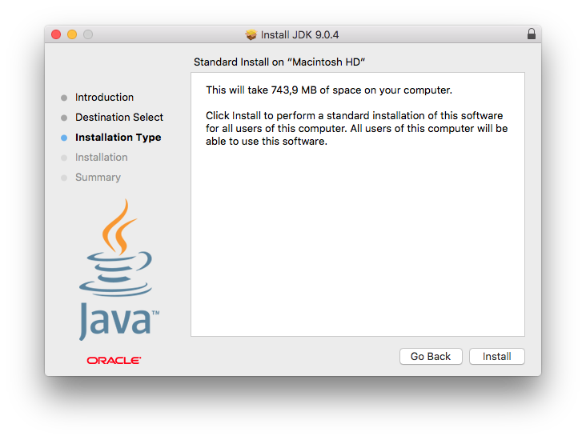{:class='screenshot'}


Click Install


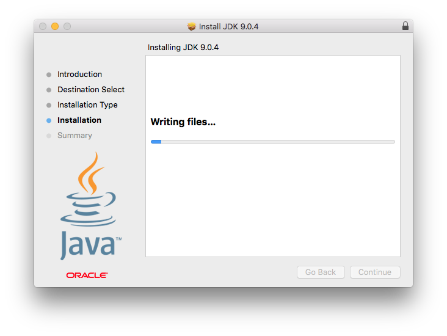{:class='screenshot'}


Wait for the installation to finish...


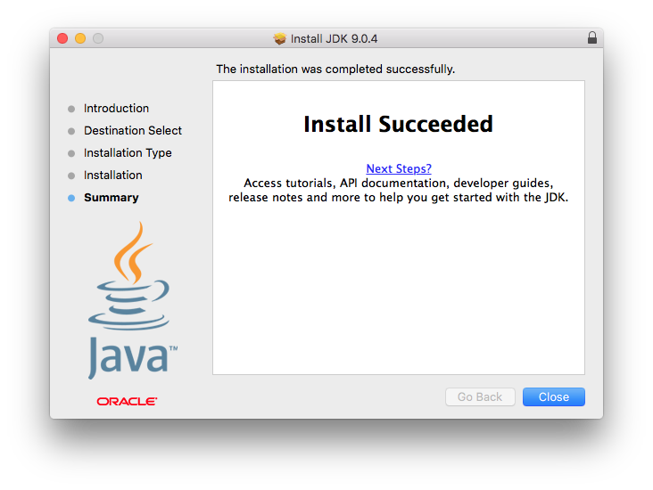{:class='screenshot'}


Click Close


# 2. Install MySQL


Download MySQL Community Server from [https://dev.mysql.com/downloads/mysql](https://dev.mysql.com/downloads/mysql) (a file named like `mysql-5.7.21-1-macos10.13-x86_64.dmg`), start it up and follow the installation instructions.


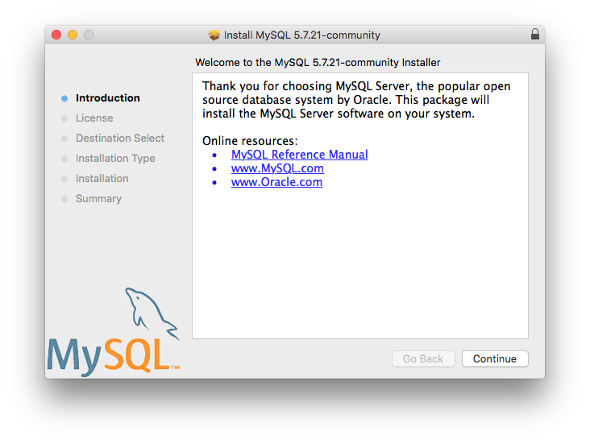{:class='screenshot'}


Click Continue


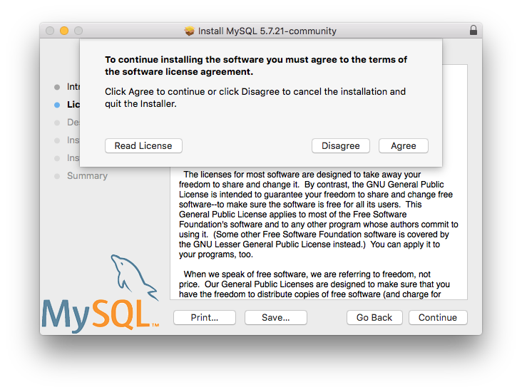{:class='screenshot'}


Accept the license by clicking Agree


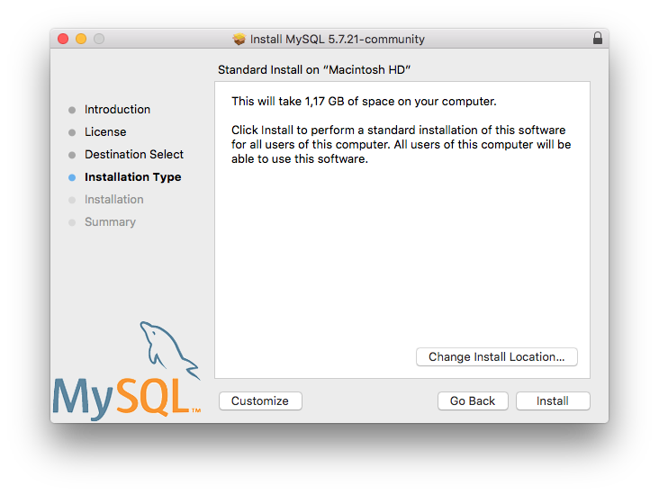{:class='screenshot'}


Click Install


{:class='screenshot'}


Wait for the installation to finish…


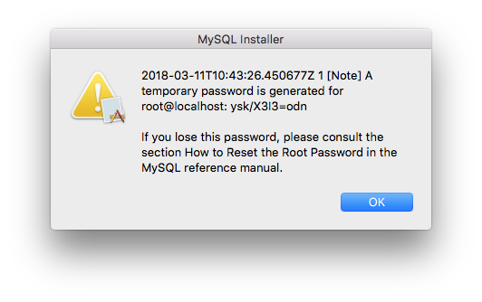{:class='screenshot'}


After a successful installation, the installer displays a window with your temporary root password. This cannot be recovered so you must save this password for the initial login to MySQL. Click OK


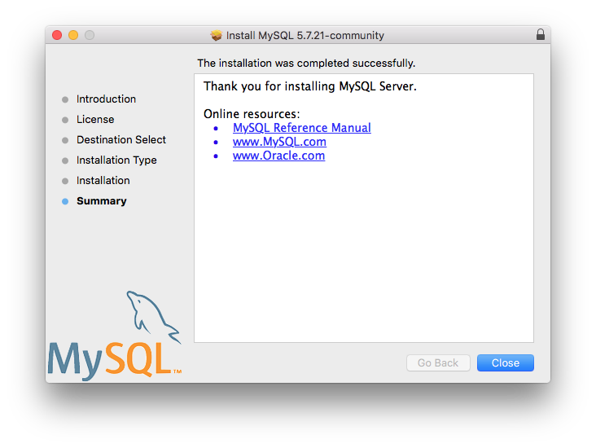{:class='screenshot'}


Click Close

## 2a. Start MySQL Server


Once installed, you need to start the MySQL Serve. Open System Preferences > MySQL


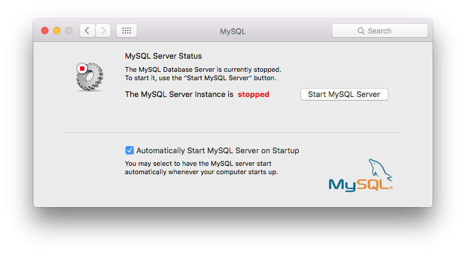{:class='screenshot'}


Start the MySQL server by clicking Start MySQL Server and wait for the server to start.


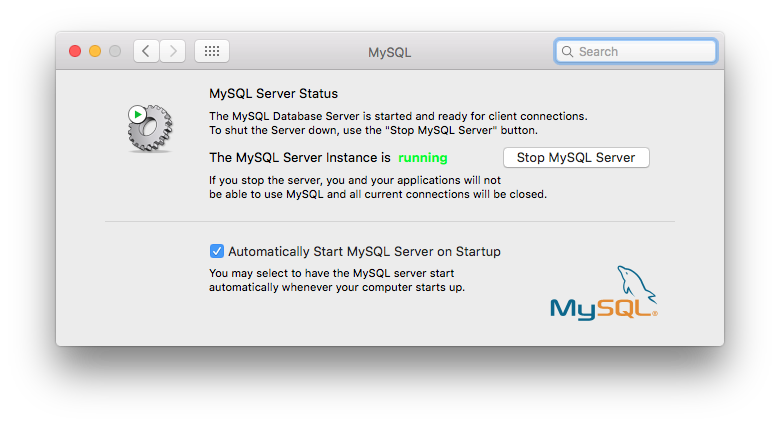{:class='screenshot'}

## 2b. Set the root password


Start the Terminal (Launchpad > Other > Terminal), execute:

```
/usr/local/mysql/bin/mysql -uroot -p
```


Type in the temporary root password you got during the installation or just hit Enter when no password was provided (MySQL 5.6). When the mysql> command prompt appears, put in the following commands:

```
alter user root@localhost identified by 'MyNewPass';
flush privileges;
exit;
```

{:class='screenshot'}


# 3. Install Apache Tomcat 8


Download Apache Tomcat 8 from [https://tomcat.apache.org/download-80.cgi](https://tomcat.apache.org/download-80.cgi) (choose zip option, a file named like `apache-tomcat-8.5.28.zip`), unzip the archive by double clicking on its name.


{:class='screenshot'}


The Apache Tomcat does not have any Mac installation. It could be just started up using the startup.sh in the bin folder, but do not do that just yet.


Note: The unzipped `apache-tomcat-8.5.28` is left in the Downloads folder, but it can be moved some place else if needed. This could be done at any time or after the installation is done.

## 3a. Add -Xmx parameter


To ensure that the Tomcat will be able to allocate enough memory, we need to set the -Xm parameter. In this manual it is set to 2 GB, but some other number can be used.


Open `apache-tomcat-8.5.28/bin/catalina.sh` file in a text editor (e.g., right click on the file > Open with … > Other > select TextEdit). Add the following line at the top of the file (as the second line):

```
export JAVA_OPTS="${JAVA_OPTS} -Xmx2g -Djava.awt.headless=true"
```


Save the file. It should look like this (note the second line):


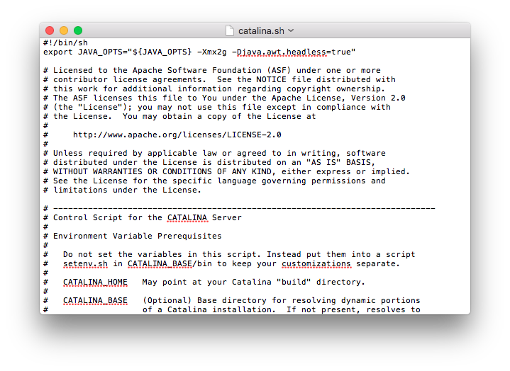{:class='screenshot'}

## 3b. Make tomcat scripts executable


In the terminal (open Launchpad > Other > Terminal), execute the following command


```
chmod +x ~/Downloads/apache-tomcat-8.5.28/bin/*sh
```

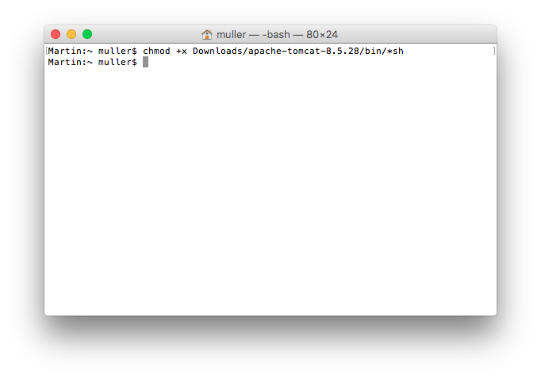{:class='screenshot'}


# 4. Install MySQL JDBC driver


Download MySQL Connector/J driver from [https://dev.mysql.com/downloads/connector/j](https://dev.mysql.com/downloads/connector/j) (choose Platform Independent ZIP Archive, a file named like `mysql-connector-java-5.1.45.zip`). Unzip the downloaded file (double click the downloaded file). In `mysql-connector-java-5.1.45`, copy the extracted `mysql-connector-java-5.1.45-bin.jar` into `apache-tomcat-8.5.28/lib`.


{:class='screenshot'}


# 5. Install UniTime


Download UniTime from [https://github.com/UniTime/unitime/releases/latest](https://github.com/UniTime/unitime/releases/latest) (a file named like `unitime-4.2_bld185.zip`) and unzip it (double click the downloaded file).

## 5a. Create and populate the timetable database


Start the Terminal (Launchpad > Other > Terminal), execute:


```
/usr/local/mysql/bin/mysql -u root -p -f <~/Downloads/unitime-4.2_bld185/doc/mysql/schema.sql
/usr/local/mysql/bin/mysql -utimetable -punitime <~/Downloads/unitime-4.2_bld185/doc/mysql/woebegon-data.sql
```


When prompted, use the MySQL root user password as provided in step 2b. You can safely ignore the DROP USER failed error (the script tries to drop the timetable user first).


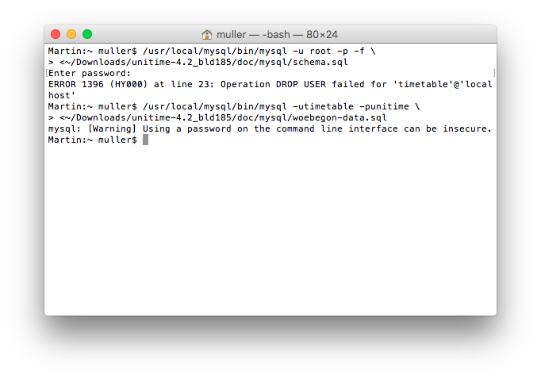{:class='screenshot'}

## 5b. Deploy the UniTime application


Copy `unitime-4.2_bld185/web/UniTime.war` (from the unzipper UniTime archive) to `apache-tomcat-8.5.28/webapps`


{:class='screenshot'}

## 5c. Create UniTime custom properties file ***(optional step)***


Create `apache-tomcat-8.5.28/conf/unitime.properties` file (e.g., by using the TextEdit application). Please note that if you are using TextEdit, you need to select Format > Make Plain Text in order to make the file plain text.


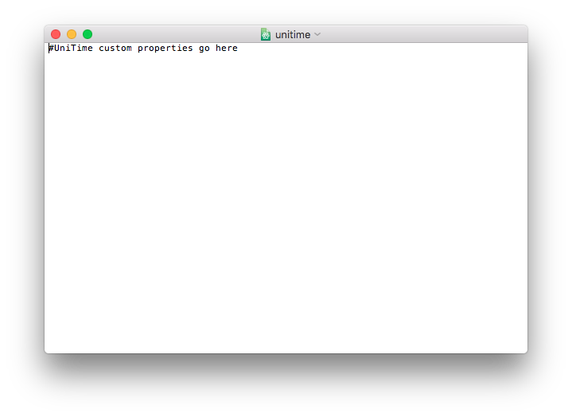{:class='screenshot'}

{:class='screenshot'}


Open `apache-tomcat-8.5.28/conf/catalina.properties` file in a text editor (e.g., right click on the file > Open with … > Other > select TextEdit). Add the following line at the bottom of the file:

```
tmtbl.custom.properties=/Users/<user>/Downloads/apache-tomcat-8.5.28/conf/unitime.properties
```


The `tmtbl.custom.properties property` needs to contain the full path leading to the newly created `unitime.properties` file.


Save the file. It should look like this (note the last line).


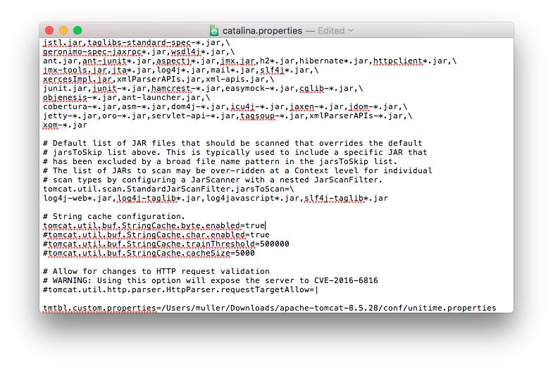{:class='screenshot'}


See [http://help.unitime.org/installation#customization](../installation#customization) for more details.


# 6. Start Tomcat


Start the Terminal (Launchpad > Other > Terminal), execute:


```
~/Downloads/apache-tomcat-8.5.28/bin/startup.sh
```


{:class='screenshot'}


Now, you should be able to open UniTime at [http://localhost:8080/UniTime](http://localhost:8080/UniTime)


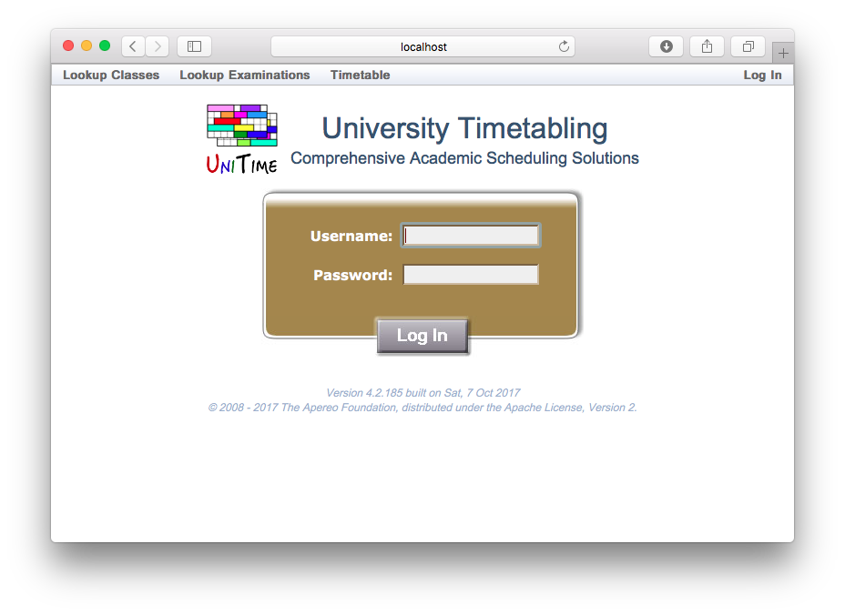{:class='screenshot'}


And log in using the admin user (both username and password is `admin`)


{:class='screenshot'}


Tomcat can be stopped the same way, but using the stop.sh script instead.


```
~/Downloads/apache-tomcat-8.5.28/bin/stop.sh
```

# 7. Check the logs for any errors ***(optional step)***


The logs are located in `apache-tomcat-8.5.28/logs` folder.


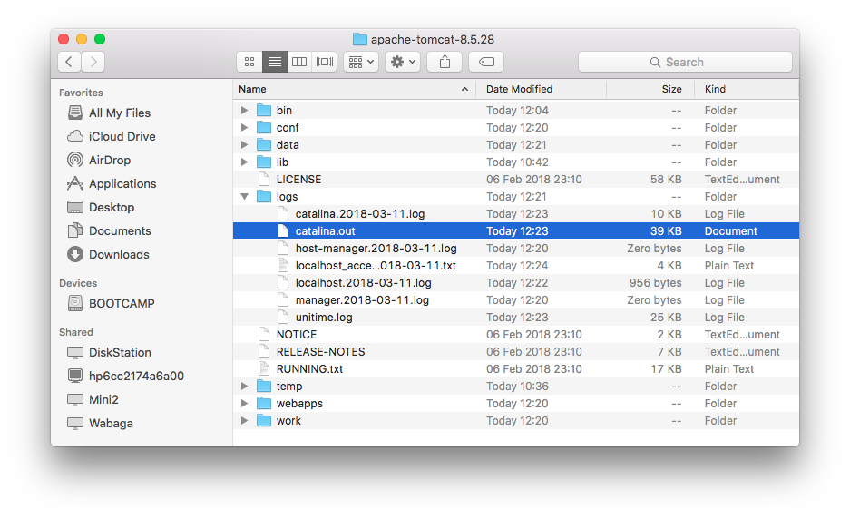{:class='screenshot'}


You can use the Utilities > Console app to view the log files.


All the UniTime related messages should be placed in the `unitime.log`, but other files (especially the `catalina.out` and `catalina.<DATE>.log`) may contain useful information. If everything started as it should, there should be the following messages in the `unitime.log` file (abbreviated):

```
[03/11/18 12:21:14] INFO   afterPropertiesSet ->  - Initializing Hibernate ... 
[03/11/18 12:21:14] INFO   Version -> HCANN000001: Hibernate Commons Annotations {4.0.5.Final}
[03/11/18 12:21:14] INFO   Version -> HHH000412: Hibernate Core {4.3.11.Final}
[03/11/18 12:21:17] INFO   ConnectionProviderInitiator -> HHH000130: Instantiating explicit connection provider: org.unitime.commons.hibernate.connection.LoggingDBCPConnectionProvider
[03/11/18 12:21:18] INFO   LoggingDBCPConnectionProvider -> Database connection pool logging is enabled.
[03/11/18 12:21:18] INFO   Dialect -> HHH000400: Using dialect: org.hibernate.dialect.MySQLInnoDBDialect
[03/11/18 12:21:27] INFO   SessionFactoryRegistry -> HHH000094: Bound factory to JNDI name: unitime:hibernate/SessionFactory
[03/11/18 12:21:27] INFO   TransactionFactoryInitiator -> HHH000399: Using default transaction strategy (direct JDBC transactions)
[03/11/18 12:21:28] INFO   <init> -> Reading file:/Users/muller/Downloads/apache-tomcat-8.5.28/webapps/UniTime/WEB-INF/lib/timetable.jar!/dbupdate.xml ...
[03/11/18 12:21:28] INFO   DatabaseUpdate -> Current UniTime database version: 123
[03/11/18 12:21:28] INFO   DatabaseUpdate ->   Performing UniTime update to version 124 (Instructor Note)
[03/11/18 12:21:29] INFO   DatabaseUpdate ->     UniTime Database version increased to: 124
[03/11/18 12:21:29] INFO   DatabaseUpdate ->   Performing UniTime update to version 125 (Solution Export XML)
[03/11/18 12:21:29] INFO   DatabaseUpdate ->     UniTime Database version increased to: 125
...
[03/11/18 12:22:13] INFO   DatabaseUpdate ->   Performing UniTime update to version 188 (Event Service Provider)
[03/11/18 12:22:15] INFO   DatabaseUpdate ->     UniTime Database version increased to: 188
[03/11/18 12:22:15] INFO   DatabaseUpdate ->   Performing UniTime update to version 189 (Larger Event Note)
[03/11/18 12:22:15] INFO   DatabaseUpdate ->     UniTime Database version increased to: 189
[03/11/18 12:22:15] INFO   DatabaseUpdate -> New UniTime database version: 189
[03/11/18 12:22:15] INFO   afterPropertiesSet ->  - Creating Message Log Appender ... 
[03/11/18 12:22:15] INFO   afterPropertiesSet ->  - Initializing Room Availability Service ... 
[03/11/18 12:22:15] INFO   afterPropertiesSet ->  - Cleaning Logs ...
[03/11/18 12:22:15] INFO   LogCleaner -> All records older than 14 days deleted from the student sectioning queue (9 records).
[03/11/18 12:22:15] INFO   afterPropertiesSet ->  - Starting Event Expiration Service ...
[03/11/18 12:22:15] INFO   EventExpirationService -> Event expiration service started.
[03/11/18 12:22:15] INFO   afterPropertiesSet -> ******* UniTime 4.2.185 build on Sat, 7 Oct 2017 initialized successfully *******
```