### Table of Contents
{:.no_toc}
* table
{:toc}


# 1. Install Oracle Java 8


Download JDK 8 from [http://www.oracle.com/technetwork/java/javase/downloads](http://www.oracle.com/technetwork/java/javase/downloads) (a file named like jdk-8u111-windows-x64.exe), start it up and follow the installation instructions.


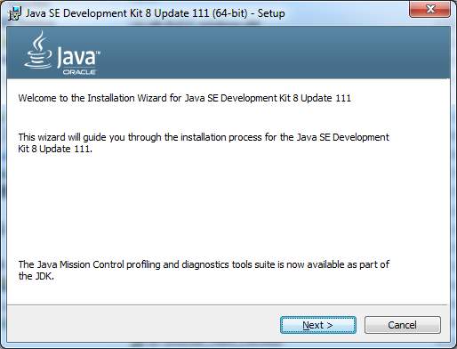{:class='screenshot'}


Hit Next


{:class='screenshot'}


Leave as it is, hit Next


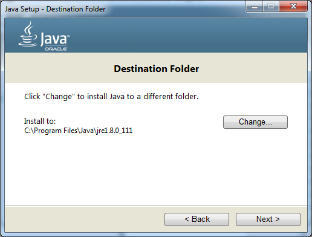{:class='screenshot'}


You can leave the destination folder as it is, click Next


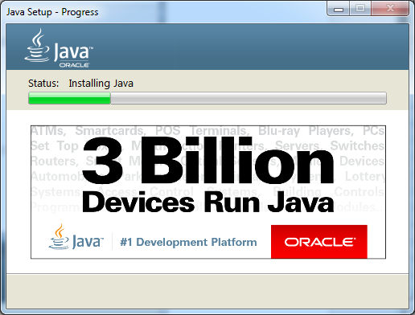{:class='screenshot'}


Wait for the setup to finish…


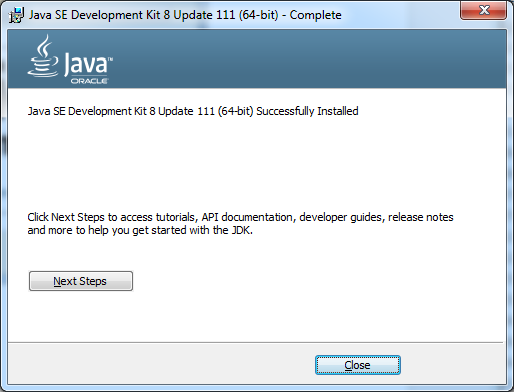{:class='screenshot'}

# 2. Install MySQL


Download MySQL Community Server from [https://dev.mysql.com/downloads/mysql](https://dev.mysql.com/downloads/mysql) (a file named like mysql-installer-web-community-5.7.17.0.msi), start it up and follow the installation instructions.


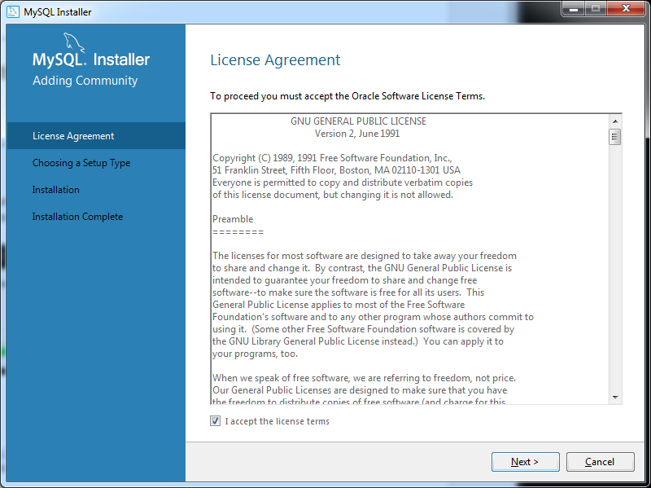{:class='screenshot'}


Accept license terms, click Next


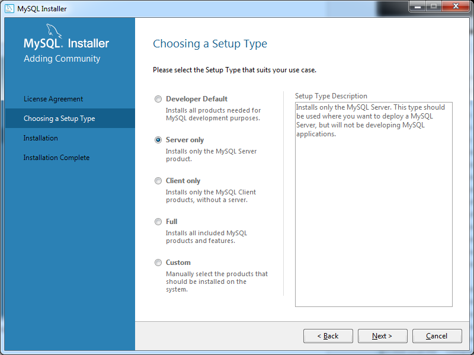{:class='screenshot'}


Select Server only (or you can leave the Developer Default), click Next


{:class='screenshot'}


Hit Execute


{:class='screenshot'}


Hit Next


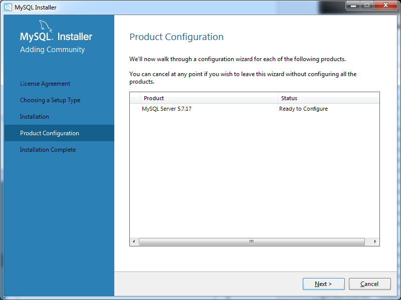{:class='screenshot'}


Hit Next


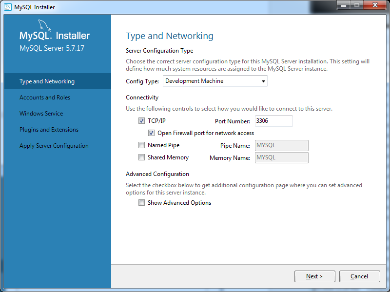{:class='screenshot'}


Leave as is (the TCP/IP needs to be enabled and set on port 3306), hit Next


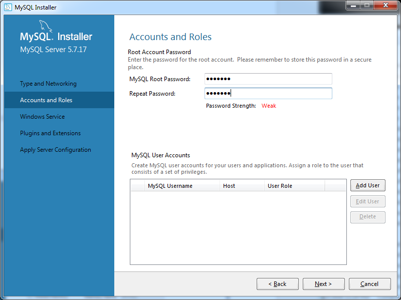{:class='screenshot'}


Type in MySQL root password of your choosing, hit Next


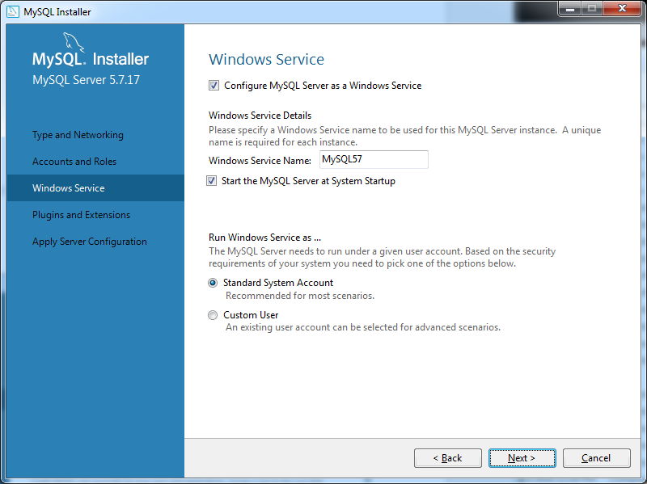{:class='screenshot'}


Leave as is, hit Next


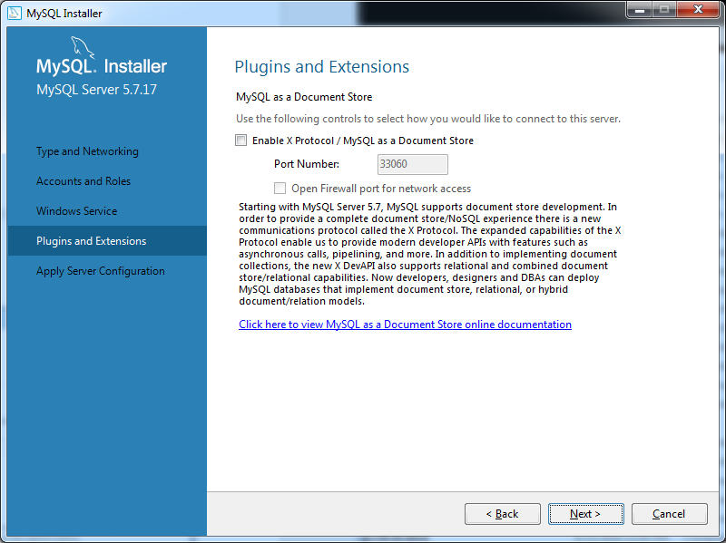{:class='screenshot'}


Leave as is, hit Next


{:class='screenshot'}


Hit Execute


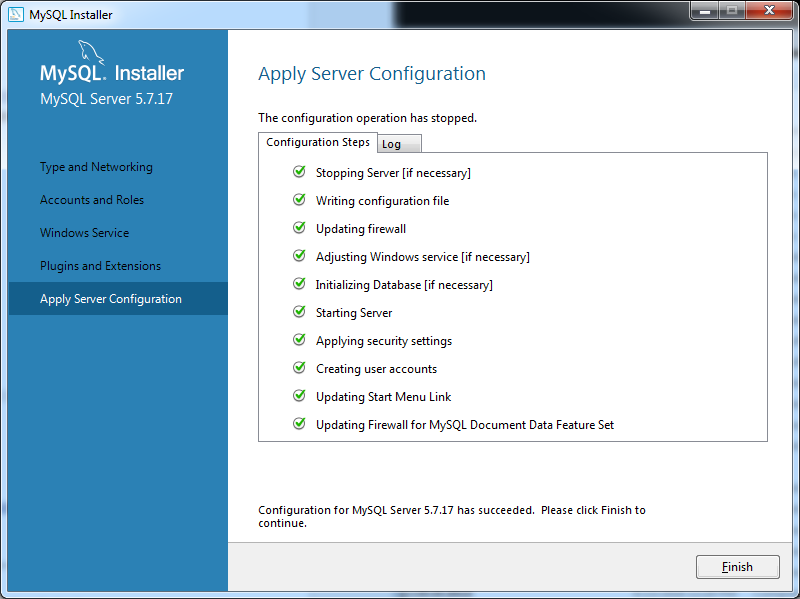{:class='screenshot'}


Hit Finish


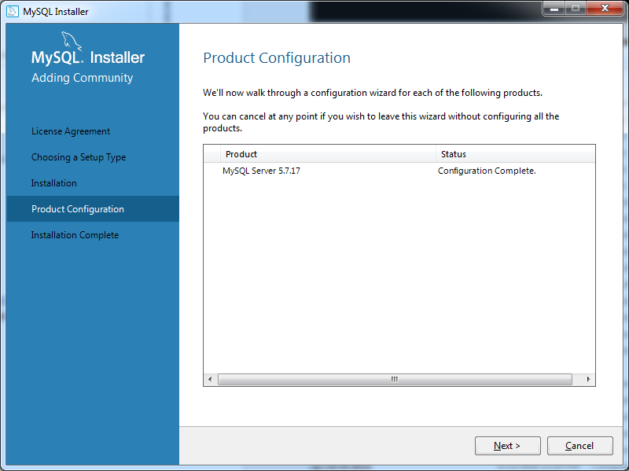{:class='screenshot'}


Hit Next


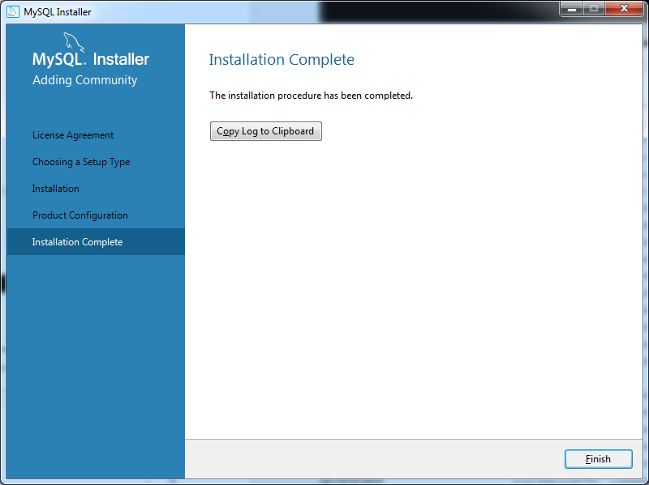{:class='screenshot'}


Hit Finish


# 3. Install Apache Tomcat 8


Download Apache Tomcat 8 from [https://tomcat.apache.org/download-80.cgi](https://tomcat.apache.org/download-80.cgi) (choose the 32-bit/64-bit Windows Service Installer option, a file named like apache-tomcat-8.5.9.ext), start it up and follow the installation instructions.


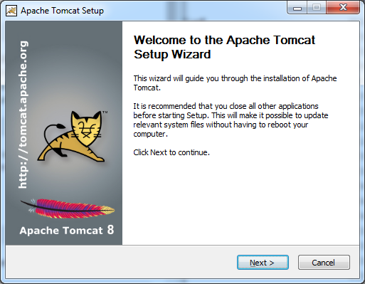{:class='screenshot'}


Hit Next


{:class='screenshot'}


Hit I Agree


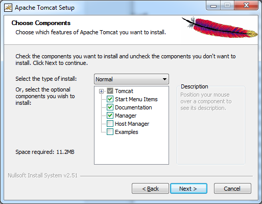{:class='screenshot'}


Leave as is, hit Next


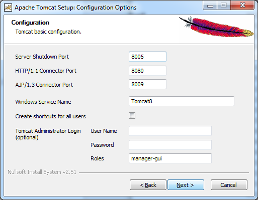{:class='screenshot'}


You can leave as is, hit Next


{:class='screenshot'}


Java installation directory should be automatically filled in, hit Next


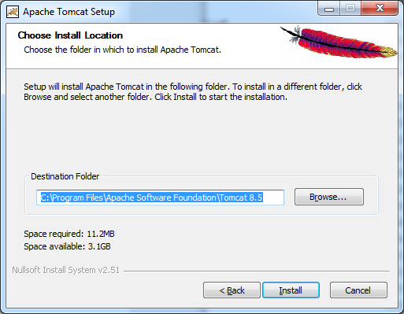{:class='screenshot'}


Leave as is, hit Next


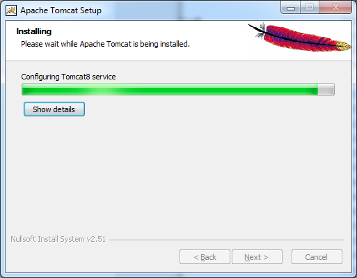{:class='screenshot'}

Wait for the setup to finish…


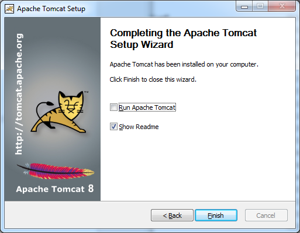{:class='screenshot'}


Do not start the Tomcat just yet (uncheck Run Apache Tomcat), hit Finish


Open Apache Tomcat configuration (Start > All Programs > Apache Tomcat 8.5 Tomcat8 > Configure Tomcat). On the Java tab, set the Maximum memory pool to at least 1024 MB.


{:class='screenshot'}


Hit Apply and OK

# 4. Install MySQL JDBC driver


Download MySQL Connector/J driver from [https://dev.mysql.com/downloads/connector/j](https://dev.mysql.com/downloads/connector/j) (choose Platform Independent ZIP Archive, a file named like `mysql-connector-java-5.1.40.zip`). Unzip the downloaded file (right-click the downloaded file and choose Extract All…). In `Downloads\mysql-connector-java-5.1.40\mysql-connector-java-5.1.40`, copy the extracted `mysql-connector-java-5.1.40-bin.jar` into `C:\Program Files\Apache Software Foundation\Tomcat 8.5\lib`.


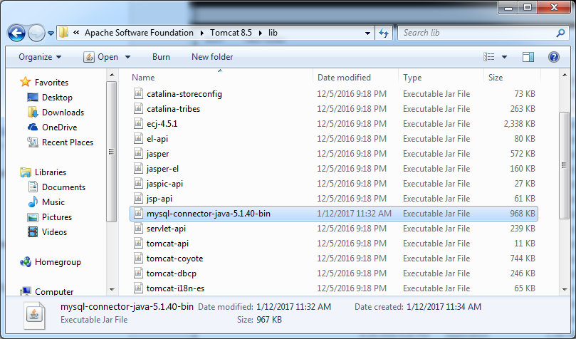{:class='screenshot'}


# 5. Install UniTime


Download UniTime from [https://github.com/UniTime/unitime/releases/latest](https://github.com/UniTime/unitime/releases/latest) (a file named like unitime-4.1_bld197.zip) and unzip it (right click the downloaded file and choose Extract All..).

## 5a. Create and populate the timetable database


Start the command prompt (Start > All Programs > Accessories > Command Prompt), execute:


```
mysql -u root -p -f <Downloads\unitime-4.1_bld197\doc\mysql\schema.sql
mysql -u root -p <Downloads\unitime-4.1_bld197\doc\mysql\woebegon-data.sql
```


When prompted, use the MySQL root user password as provided in step 2.


You can safely ignore the DROP USER failed error (the script tries to drop the timetable user first).


If you get `mysql` is not recognized as an internal or external command, operable program or batch file.“ error, use `"c:\Program Files\MySQL\MySQL Server 5.7\bin\mysql.exe"` instead.


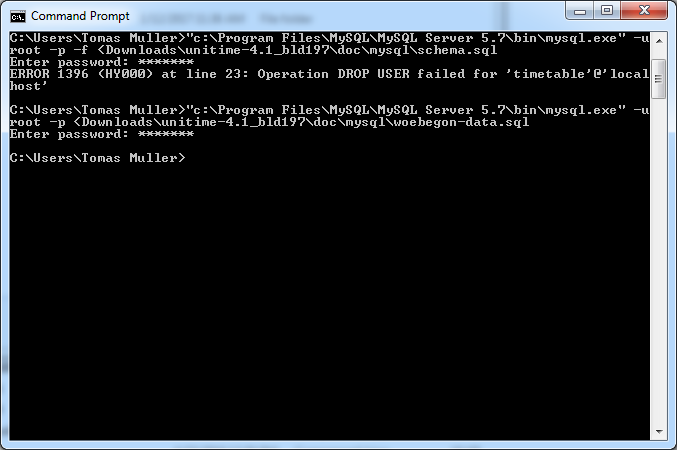{:class='screenshot'}

## 5b. Deploy the UniTime application


Copy `web\UniTime.war` from the unzipper UniTime archive to `C:\Program Files\Apache Software Foundation\Tomcat 8.5\webapps`


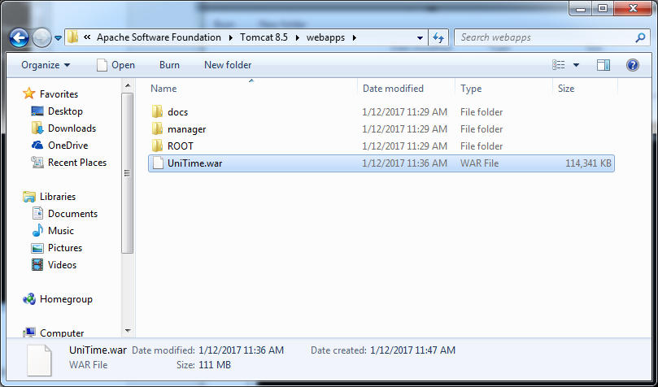{:class='screenshot'}

## 5c. Create UniTime custom properties file ***(optional step)***


Create `C:\Program Files\Apache Software Foundation\Tomcat 8.5\conf\unitime.properties` file (e.g., by using Notepad -- please note that you need to run the Notepad application as administrator to be able to create a file in Tomcat 8.5\conf folder)


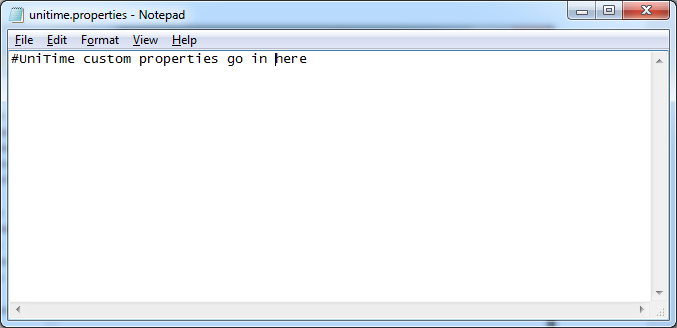{:class='screenshot'}


When saving the file, name it `unitime.properties` (with the double quotation marks) to tell the Notepad not to add the .TXT extension to the file name.


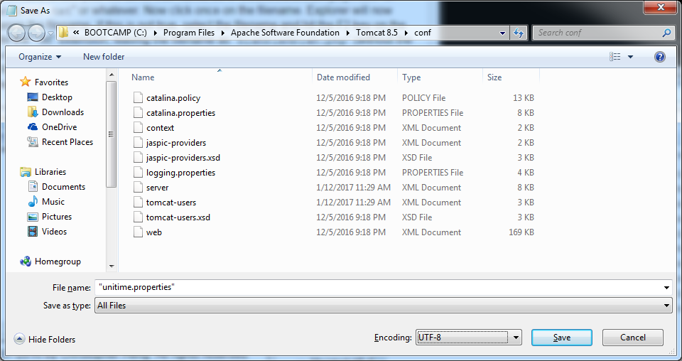{:class='screenshot'}


Open `catalina.properties` in the same folder, add the following line and save it again.


```
tmtbl.custom.properties=C:\\Program Files\\Apache Software Foundation\\Tomcat 8.5\\conf\\unitime.properties
```


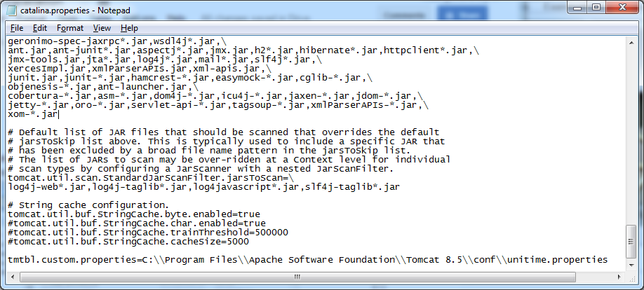{:class='screenshot'}


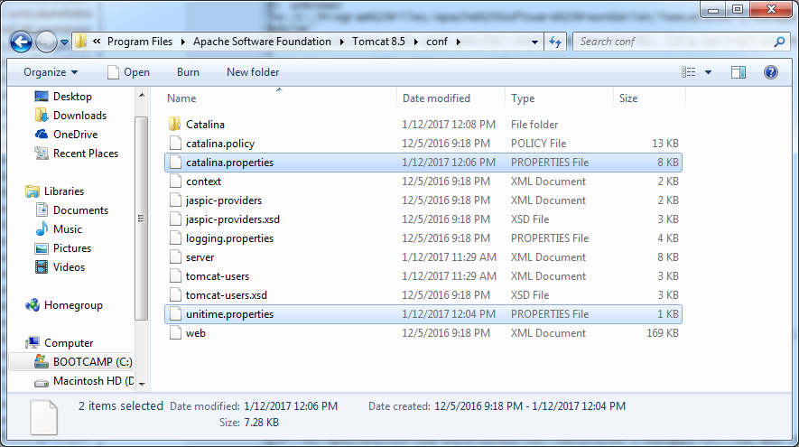{:class='screenshot'}


See [http://help.unitime.org/installation#customization](../installation#customization) for more details.


# 6. Start Tomcat


Open Apache Tomcat configuration (Start > All Programs > Apache Tomcat 8.5 Tomcat8 > Configure Tomcat).


{:class='screenshot'}


On the General tab, hit Start (you can change the Startup type to Automatic if you with Apache Tomcat to start automatically after Windows restart).


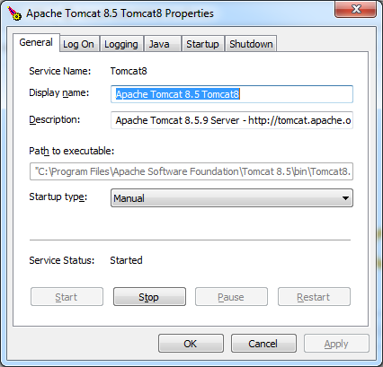{:class='screenshot'}


The Tomcat is running (you can stop the Tomcat here as well). Hit OK to close the dialog.


Now, you should be able to open UniTime at [http://localhost:8080/UniTime](http://localhost:8080/UniTime)


{:class='screenshot'}


And log in using the admin user (both username and password is admin)


{:class='screenshot'}

# 7. Check the logs for any errors ***(optional step)***


The logs are located at `C:\Program Files\Apache Software Foundation\Tomcat 8.5\logs`


{:class='screenshot'}


All the UniTime related messages should be placed in the `unitime.log`, but other files (especially the `catalina.<DATE>.log`, `tomcat8-stderr.<DATE>.log`, and `tomcat8-stdout.<DATE>.log`) may contain useful information. If everything started as it should, there should be the following messages in the unitime.log file (abbreviated):


```
[01/12/17 12:08:57] INFO   afterPropertiesSet ->  - Initializing Hibernate ... 
[01/12/17 12:08:57] INFO   Version -> HCANN000001: Hibernate Commons Annotations {4.0.5.Final}
[01/12/17 12:08:57] INFO   Version -> HHH000412: Hibernate Core {4.3.11.Final}
[01/12/17 12:08:58] INFO   Dialect -> HHH000400: Using dialect: org.hibernate.dialect.MySQLInnoDBDialect
[01/12/17 12:09:02] INFO   SessionFactoryRegistry -> HHH000094: Bound factory to JNDI name: unitime:hibernate/SessionFactory
[01/12/17 12:09:02] INFO   <init> -> Reading file:/C:/Program Files/Apache Software Foundation/Tomcat 8.5/webapps/UniTime/WEB-INF/lib/timetable.jar!/dbupdate.xml ...
[01/12/17 12:09:02] INFO   DatabaseUpdate -> Current UniTime database version: 123
[01/12/17 12:09:02] INFO   DatabaseUpdate ->   Performing UniTime update to version 124 (Instructor Note)
[01/12/17 12:09:04] INFO   DatabaseUpdate ->     UniTime Database version increased to: 124
[01/12/17 12:09:04] INFO   DatabaseUpdate ->   Performing UniTime update to version 125 (Solution Export XML)
[01/12/17 12:09:04] INFO   DatabaseUpdate ->     UniTime Database version increased to: 125
...
[01/12/17 12:10:09] INFO   DatabaseUpdate ->   Performing UniTime update to version 158 (Preference abbreviations)
[01/12/17 12:10:10] INFO   DatabaseUpdate ->     UniTime Database version increased to: 158
[01/12/17 12:10:11] INFO   DatabaseUpdate ->   Performing UniTime update to version 159 (Fix attachment typo)
[01/12/17 12:10:11] INFO   DatabaseUpdate ->     UniTime Database version increased to: 159
[01/12/17 12:10:11] INFO   DatabaseUpdate ->   Performing UniTime update to version 160 (Distribution types visibility)
[01/12/17 12:10:12] INFO   DatabaseUpdate ->     UniTime Database version increased to: 160
[01/12/17 12:10:12] INFO   DatabaseUpdate -> New UniTime database version: 160
[01/12/17 12:13:10] INFO   afterPropertiesSet ->  - Creating Message Log Appender ... 
[01/12/17 12:13:11] INFO   afterPropertiesSet ->  - Initializing Room Availability Service ... 
[01/12/17 12:13:11] INFO   afterPropertiesSet ->  - Cleaning Logs ...
[01/12/17 12:13:11] INFO   afterPropertiesSet ->  - Starting Event Expiration Service ...
[01/12/17 12:13:11] INFO   EventExpirationService -> Event expiration service started.
[01/12/17 12:13:11] INFO   afterPropertiesSet -> ******* UniTime 4.1.197 build on Wed, 27 Jul 2016 initialized successfully *******
```