### Table of Contents
{:.no_toc}
* table
{:toc}

# 1. Introduction


 In UniTime 4.2, a new component for automatic assignment of instructors to classes or courses has been created. The instructors (e.g., teaching assistants) are expected to be assigned after the course timetabling and student scheduling is done, using information from both course timetabling (course timetable) and student scheduling (student availability).


 


 The instructors that are to be automatically assigned to classes are included in the list of instructors (Instructors page), the distinction is made by their maximal load (zero means no automatic assignment) and teaching preferences (prohibited also means no assignment).


 


 The automatic assignment can be based on various instructor attributes that can be defined globally or on a departmental level. These attributes can be grouped by type (e.g., skill or performance level, qualification, certification).


 


 The following data are needed to be entered on instructors:

* List of instructors (e.g., teaching assistants) that can be used for instructor assignment

* Maximal load of an instructor (could be in hours or any other arbitrary units)

* Teaching preference (from strongly preferred to prohibited)

* Attributes of the instructor

* Time requirements and course preferences

* Distribution preference (back-to-back, same days, and same rooms are considered)


 


 The following data are needed to be entered on courses (teaching requests):

* Each teaching request contains a number of instructors needed and the teaching load

* Whether the instructor is to be assigned as course coordinator

* List of classes that the instructor would teach (usually following the parent-child relation)

* List of additional classes during which the instructor must be available (e.g., the lecture)

* Additional information that should be copied over to the instructor assignment (percent share, lead, teaching responsibility)

* Some classes may be allowed to overlap in time, in which case the overlapping time is to be minimized

* Instructor and attribute preferences and requirements

* For instructors that can have multiple assignments, there is a preference for the assignments to be of the **same course** (e.g., a different Lab-Rec pair) and/or to share the **same common** part (e.g., the lecture)


 


 Instructor scheduling considers various hard and soft constraints. The hard constraints include:

* Maximal load of the instructor (each teaching assignment has a load defined, and there is a maximal load defined on each instructor)

* The instructor must be available (unless allowed, there is no other overlapping teaching assignment, the assignment is not during a prohibited time and, if the instructor is also student, he/she does not have any classes at the time of the assignment)

* Instructors with prohibited teaching preference cannot be used

* Required and prohibited attribute, instructor, course preferences must be obeyed

* Required and prohibited same course, same common must be obeyed 

* Required and prohibited back-to-back, same day, same room constraints that are set on the instructor must be obeyed

* If a teaching request require two or more instructors, different instructors must be used


 


 The optimization criteria (soft constraints) include

* If time overlaps are allowed, minimize the total overlapping time

* Maximize the number of satisfied soft preferences (strongly preferred, preferred, discouraged, or strongly discouraged) based on teaching, time, attribute, instructor, course preferences, same course and same common constraints, and back-to-back, same day, same room distribution preferences

* Maximize original assignment in the MPP mode (Minimal Perturbation Problem)

* Minimize unused instructor load for instructors with one or more assignments (that is the difference between the maximal load of the instructors and the sum of the loads of the assigned teaching assignments)


 


 The instructor assignments can be computed automatically, using the instructor scheduling solver. After that, manual changes can be made with either the solver still running in memory (and providing suggestions) or without the solver in which case the assignment changes are made directly in the database.


 


 The instructor scheduling problem is solved separately for each department. Only one solution can be saved for each department (like with the examinations). There is a commit process, however, and the actual instructor assignments and course coordinators are only populated when the solution is committed. Otherwise, the teaching assignments that were computed by the solver are only kept on the individual teaching request and they do not show outside of the department.


 


# 2. Instructor Attributes


 First of all, instructor attribute types may need to be defined / reviewed. These are available at the Administration > Other > Instructor Attribute Types


 


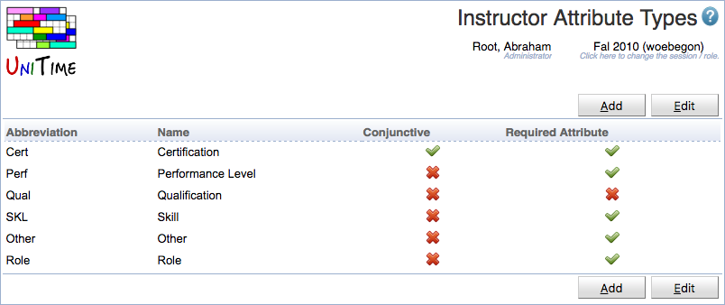{:class='screenshot'}
Example of the Administration > Other > Instructor Attribute Types page


 


 Instructor attribute types are academic session independent (the same set is used across all academic sessions). Each attribute type has an abbreviation, a name, and two toggles:

* **Conjunctive**: if two or more attributes of the same conjunctive type are required on a teaching request, this means that only instructors that have ALL the indicated required attributes can be used (same as with room features). If the attribute type is disjunctive (conjunctive toggle is unchecked), it is sufficient for the instructor to have just one of the required attributes of the given type (same as with room groups).

* **Required Attribute**: If a teaching request has a preference of an attribute that is of the required attribute type (unless the preference is prohibited), the preference is considered as required and the actual preference is used to compare two instructors.


 For example, if a teaching request strongly prefers Organic Chemistry Skill and prefers Inorganic Chemistry Skill (assuming that the Skill is a required disjunctive attribute type), an instructor must have either Organic Chemistry Skill or Inorganic Chemistry Skill (because of the required attribute type). Among these, instructors with both skills are most preferred, after which instructors with only the Organic Chemistry Skill are preferred before instructors with only the Inorganic Chemistry Skill (because of the strongly preferred preference on the Organic Chemistry Skill).


 If the Skill attribute type is not marked as required attribute, instructors without the above two skills can also teach the course but are less preferred than instructors with one or both of the above two skills.


 


 Individual instructor attributes can be defined on the Courses > Input Data > Instructor Attributes page. An instructor attribute can be either global (for all departments of the academic session) or departmental (only related to a particular department).


 


 Each attribute has an abbreviation, name, type (see above), and it can be associated with a list of instructors. An instructor can have multiple attributes of the same type. It is also possible to define a parent of an attribute. This is useful if there is a hierarchy, e.g., an experienced instructor can teach advanced courses, but he/she can also teach beginner classes. In other words, if a particular attribute is preferred or required, instructors with the same attribute or with one of the parent attributes (attribute parent of the selected attribute, or the parent of the parent attribute, etc.) meet the preference or requirements.


 


{:class='screenshot'}
An example of the Courses > Input Data > Instructor Attributes page.


 


# 3. Instructor Setup


 Instructor attributes and other requirements can be set on the instructors. There is the Instructor Assignment Preferences page that can be reached from the Instructor Detail page by clicking the Edit Assignment Preferences button.


 


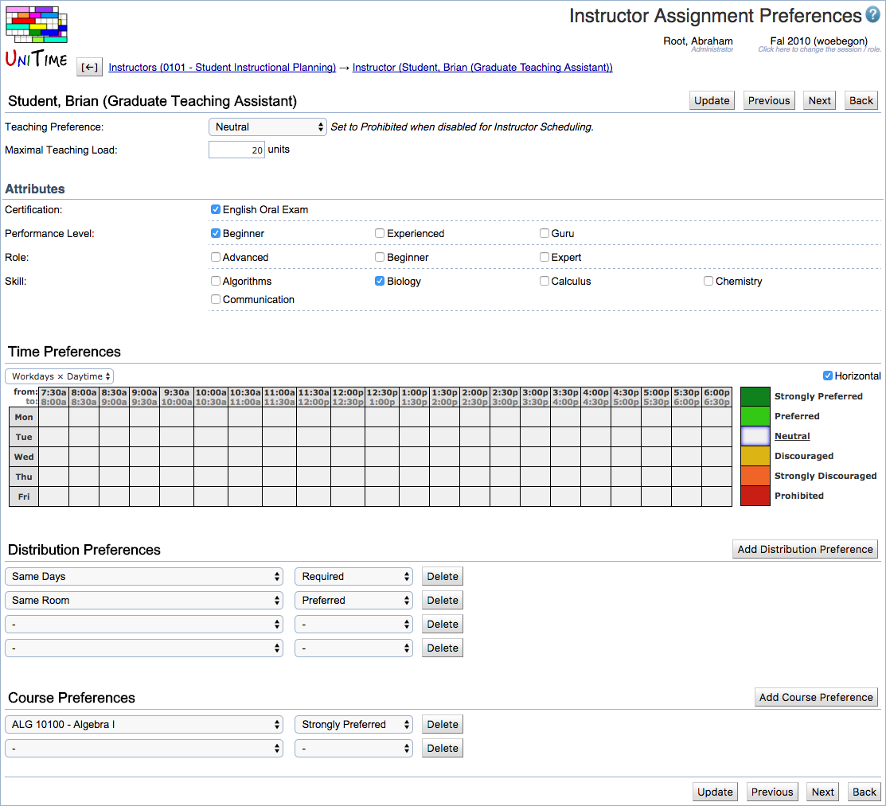{:class='screenshot'}
An example of the Instructor Assignment Preferences page.


 


 This page allows to set the teaching preference (defaults to Prohibited -- the instructor cannot be used for the automated instructor scheduling), maximal teaching load, instructor attributes (grouped by type), time preferences, distribution preferences, and course preferences. The time and distribution preferences are the same as on the Instructor Preferences page. Distribution preferences other than Back-To-Back, Same Room, and Same Days are ignored by the instructor scheduling solver at the moment.


 


 The new attribute and preferences are also displayed on the Instructor Detail page and on the Instructors list.


# 4. Teaching Requests Setup


 Instructors that are to be assigned automatically are not requested directly on classes, but there are teaching requests. Each teaching request may include multiple classes of the same course and provide some additional constraints.


 
| **Teaching Request** |
 | Number of Instructors | 1 or more |
 | Teaching Load | in the number of units (could be hours) |
 | Teaching Responsibility | optional parameter, used in the class / coordinator assignment |
 | Assign Coordinator | boolean, with additional information for the assignment (percent share) |
 | List of Classes | with additional information <br/>-whether to assign the instructor (boolean)<br/>-if to be assigned: percent share, lead<br/>-can overlap (minimize overlapping time when allowed)<br/>-is common part (e.g., the lecture) |
 | Preferences & Requirements | attribute preferences, grouped by attribute typesinstructor preferences |
 | Same Course Preference | should all the assignments of an instructor be for the same course, defaults to required |
 | Same Common Preferences | available when there are multiple common classesshould all the assignments of an instructor share the same common class, defaults to neutral |
 


 


 The teaching requests are visible on the Instructional Offering Detail page (there is a new Teaching Requests section on the page), and can be setup using the Setup Teaching Requests page. The Setup Teaching Requests page can be reached by clicking the button of the same name in the Teaching Requests section of the Instructional Offering Detail page.


 


 To demonstrate how the teaching requests can be configured, let’s consider a course with 3 Lectures and 12 Labs and 12 Recitations in a parent-child relation as follows.


 


```
Lec 1
    Lab 1
        Rec 1
    Lab 2
        Rec 2
    Lab 3
        Rec 3
    Lab 4
        Rec 4
Lec 2
    Lab 5
        Rec 5
    …
    Lab 8
        Rec 8
Lec 3
    Lab 9
        Rec 9
    …
    Lab 12
        Rec 12
```
***An example of a course for which we need Teaching Assistants to be assigned.***


 


 Now, imagine that we need two course coordinators (of the TA Supervisor responsibility) for the course that should be available during the lectures (the lectures can overlap with their unavailability, but we want to minimize the overlapping time). Next to that, we want a teaching assistant for each Lab - Rec pair. Each full-time teaching assistant (let’s consider a maximal load of 20 hours for a full-time TA) can teach two pairs, that should be of the same lecture. This means that a TA teaching Lab 1 - Rec 1 should rather teach Lab 3 - Rec 3 than for instance Lab 3 - Rec 5 combination as the later has a different lecture. The TA needs to be fully available during the lecture as well as during the labs and recitations he/she is teaching. All instructors must have the Chemistry skill and the coordinators must have more experience. We can also require that a TA cannot have teaching assignments of different courses. This can be configured using the Setup Teaching Requests as follows:


 


{:class='screenshot'}
An example of the Setup Teaching Requests page, upper half.


 


 All the individual teaching assistant assignments are configured in the first table (1. Teaching Request). Each teaching request has a teaching load of 10 units (hours). The requests are configured for the Recitation subpart, and there is one instructor required for each recitation (table Classes). With the recitation, the instructor is also assigned to the appropriate Laboratory and he/she needs to be available during the Lecture. This is configured in the Include Subparts table. For each class (following the parent - child relation), there is information on whether the person is to be assigned to the class as an instructor (Assign column), and if so, what are the percent share and lead attribute. Can Overlap column indicate whether the instructor must be available during the time of the class or whether the overlapping time is to be minimized. The Common column defines which is the common part of the assignment (an instructor can teach two Lab - Rec pairs of the same lecture because they share the same common). The same course and same common preferences are indicated below the Include Subparts table. This is followed by attribute and instructor preferences. These are the same for all 12 Lab - Rec teaching requests. It is possible to indicate different preferences / requirements by splitting the teaching requests into multiple tables.


 


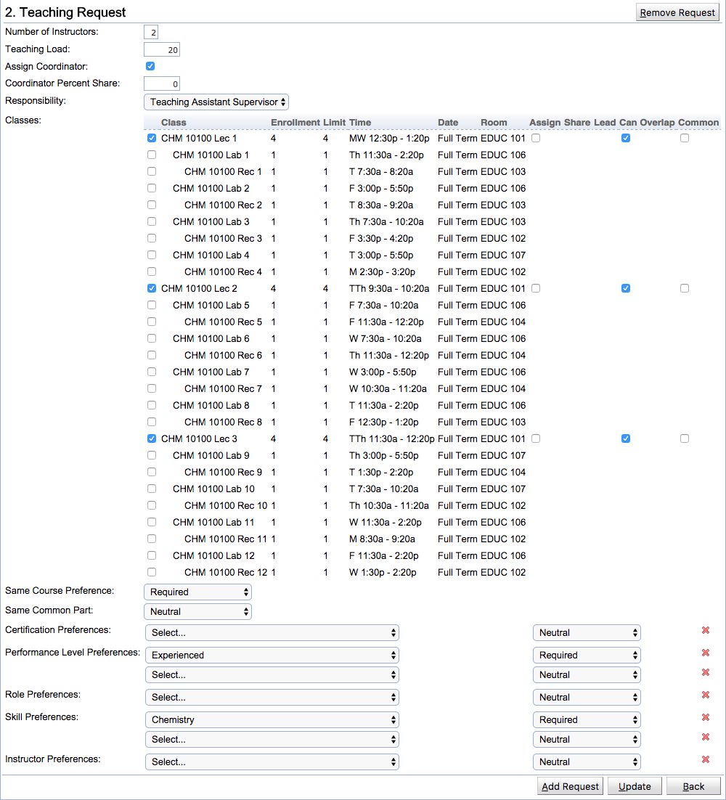{:class='screenshot'}
An example of the Setup Teaching Requests page, bottom half.


 


 The course coordinators are configured in the second part of the page, 2. Teaching Request table. There can be as many teaching request tables as needed (a new one can be added by clicking the Add Request button or the existing one can be deleted by clicking the Remove Request button). Here, we require two full-time instructors that should be available during all three lectures.


 


 The created teaching requests are visible in the Teaching Requests section of the Instructor Offering Detail page and can be edited by clicking the Setup Teaching Requests button again.


 


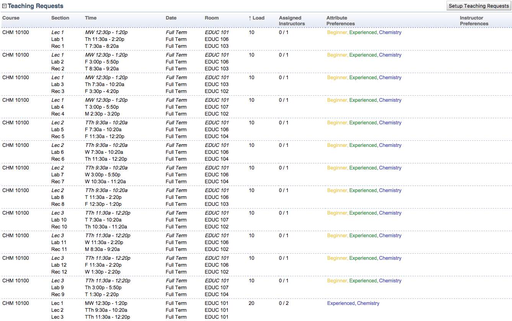{:class='screenshot'}
Example of the Teaching Requests section on the Instructional Offering Detail page


 


 Once the solver has run, the table also shows the current instructor assignments, together with their details (instructor external id, name, assigned / maximal teaching load, attributes, time, course, and distribution preferences). Teaching Request Detail dialog is shown when a teaching request is clicked that allows to see more details and to make an assignment change with or without the solver loaded in memory (see the Solver chapter below for more details).


# 5. Instructor Scheduling Solver


 The instructor scheduling solver works much like any other UniTime solver. It can be loaded, unloaded, started, saved, etc. using the Courses > Instructor Scheduling > Instructor Scheduling Solver page. There is a Solver Log page, a page with assigned and not-assigned teaching requests, and a page with changes, and a page with teaching assignments. The Teaching Assignments page provides a view from the instructor perspective whereas the Assigned (and Not-Assigned) Teaching Requests show the solutions from the teaching requests / courses perspective. Teaching requests and teaching assignments can be filtered by subject area or department, courses, instructors, or the individual attributes. More details are visible when a line (either a teaching request or a teaching assignment is clicked). The details page allows for manual assignments and can also provide suggestions (when the data are loaded in the solver). It can switch between details of a particular teaching request or a particular instructor.

### Instructor Scheduling Solver Page


 The solver page has the following operations:

 | Load | Load the data (instructors and teaching requests) into the solver |
 | Unload | Unload the solver |
 | Start | Start the solver |
 | Stop | Stop the solver |
 | Refresh | Refresh the page |
 | Reload Input Data | Reload input data while keeping the current instructor assignments |
 | Clear | Clear current assignments (make all variables unassigned) |
 | Save | Save the current solution (teaching assignments) |
 | Save & Commit | Save the current solution and populate course coordinators and class instructors (commit the solution) |
 | Save & Uncommit | Save the current solution, but remove the course coordinators and class instructors associated with this problem (uncommit the solution) |
 | Save To Best | Copy the current solution over the best ever found solution |
 | Restore From Best | Copy the best solution into the current solution |
 | Export XML | Export the problem in the solver-compatible XML format |
 


 

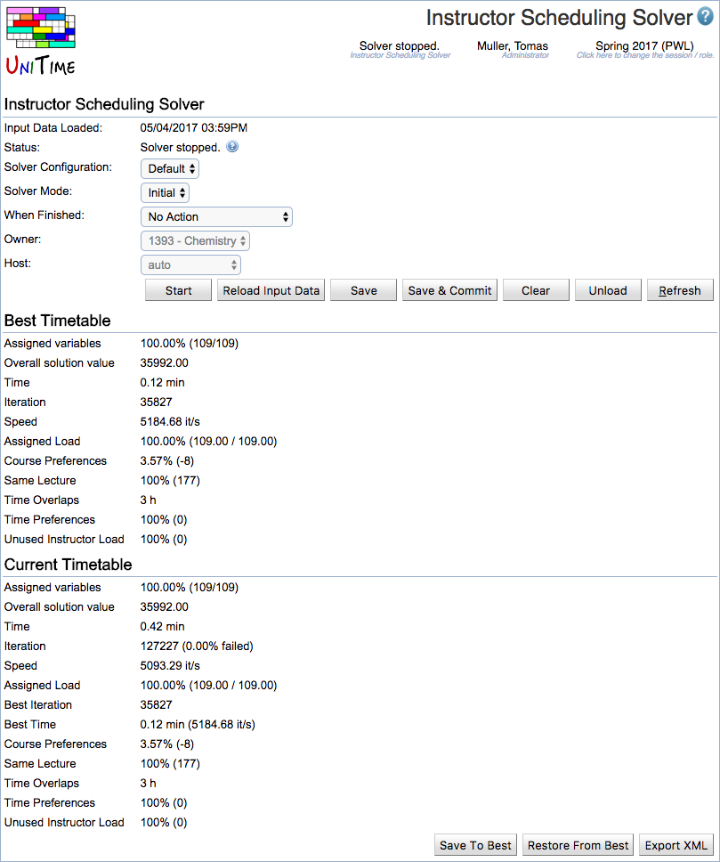{:class='screenshot'}
Example of the Instructor Scheduling Solver page


 


 The solver works with two solutions, current solution and the best ever found solution. This helps the solver to keep a record of the best solution is has seen while it is making changes in the current solution. A number of properties about the best and the current solutions are listed, these include the number of assigned variables (teaching requests, a complete solution should have 100%), the overall solution value (this is a weighted sum of all the optimization criteria, which the solver is trying to minimize), time and iteration when the current solution was reached and a number of optimization criteria that are being considered (criteria that are not used are not displayed):


 
| Attribute Preferences | This criterion counts how well are the soft attribute preferences (that are set on teaching requests) met |
 | Back To Back | Instructor back-to-back preferences |
 | Course Preferences | How well are the soft course preferences (which are set on instructors) are met |
 | Instructor Preferences | This criterion counts how well are the soft instructor preferences (that are set on teaching requests) met |
 | Original Instructor | When the solver is used in the MPP (Minimal Perturbation Problem) mode, this criterion penalizes teaching assignments that are not given to the initial instructor |
 | Same Common | This criterion counts how well are the soft same common preferences (that are set on teaching requests) met |
 | Same Course | This criterion counts how well are the same course preferences (that are set on teaching requests) met |
 | Same Days | Instructor same days preferences |
 | Same Room | Instructor same room preferences |
 | Teaching Preference | This criterion counts how well are the soft teaching preferences (that are set on instructors) met |
 | Time Overlaps | Total overlapping time (in hours) for all assignments that are allowed to overlap. This criterion counts times during which an instructor has to teach (or attend) two things that are overlapping in time (the time overlaps must be allowed in this case). |
 | Time Preferences | This criterion counts how well are the soft instructor time preferences met |
 | Unused Instructor Load | If an instructor is being used (has at least one teaching assignment),  this criterion can penalize the remaining (unused) load of the instructor. That is the difference between instructor maximal load and the assigned load of the instructor |
 


 


 As mentioned above, any attribute, course, time, instructor, same common, same course, or distribution preferences that have Required or Prohibited preference must be satisfied. The strongly preferred, preferred, discouraged, and strongly discouraged preferences are counted in the above criteria and a weighted sum of these criterions is used to compare two solutions.


 


 The various solver weights and other parameters are configured on the Administration > Solver > Configurations page. See the configuration with Instructor Scheduling Solver appearance.

### Instructor Scheduling Solver Log


 The Instructor Scheduling Solver Log page can be useful to see what the solver has been doing. Also, any solver warnings and errors are listed in here.


 


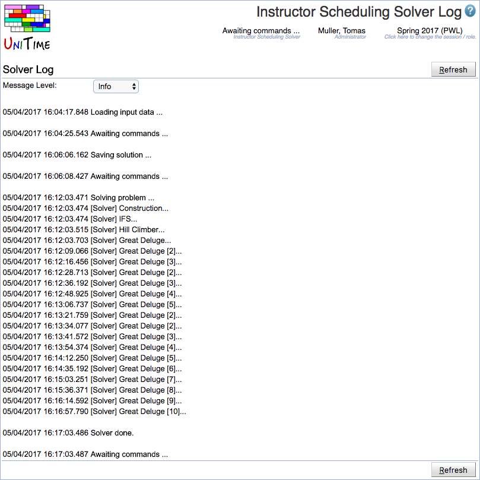{:class='screenshot'}
An example of the Instructor Scheduling Solver Log page

### Assigned Teaching Requests / Not-Assigned Teaching Requests


 The list of assigned or not-assigned teaching requests can be seen on the Assigned Teaching Requests or the Not-Assigned Teaching Requests page respectively. The page can either show the data as they are assigned in the solver (showing the current solution, when the solver is loaded in memory) or the teaching assignments as they are saved in the database.


 

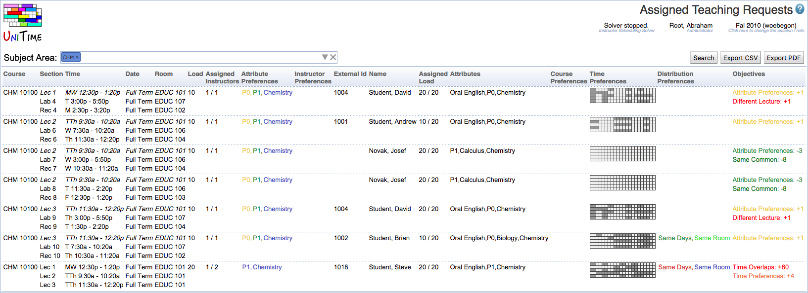{:class='screenshot'}
An example of the Assigned Teaching Requests page


 


 The page consists of a filter that allows to search for teaching requests by their subject area, individual attributes (that are requested or that the assigned instructors have), by a particular course or instructor.


 


 The table shows a list of assigned (or not-assigned) teaching requests meeting the above filter. Each teaching request contains the course, the list of classes it applies to (classes that are not to be assigned to the instructor are in italics -- e.g., the lecture) with their date, time, and room assignments. Next, there is the requested load, the number of assigned / requested instructors, and the requested attribute and instructor preferences. The Assigned Teaching Requests page also contains information about the assigned instructor. That is, the instructor’s external id, name, teaching preference (shown as the color of the instructor’s external id and name), assigned / maximal teaching load, instructor attributes, course, time and distribution preferences. The time preferences grid also contains times when the instructor is not available because he is enrolled in a class as a student, or he/she is assigned to a class as an instructor outside of the instructor scheduling problem (gray color). The last column contains individual penalization of various criteria for the assignment.


 


 The table page can be sorted by any column and particular columns can be shown / hidden using the context menu on the table header. The content of the table can be exported in CSV (comma separated value) or PDF format using the Export CSV or Export PDF buttons respectively. The exported file contains the same columns as they are currently visible on the page and the requests are ordered in the same manner as well.


 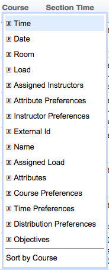{:class='screenshot'}


 


 More details are shown when a particular teaching request is clicked. The details contain information about the selected teaching request and the assigned instructor(s), if there are any. The dialog also shows other instructors that are available to teach the selected request and their conflicts. These are their current teaching assignments that would have to be unassigned for the instructor to be able to teach the selected request. If the solver is loaded in memory, the dialog also shows a list of solver computed suggestions containing suggestions up to three changes. More suggestions can be computed by searching longer (Search Longer button, when the default search limit is reached during the computation) or by increasing the number of allowed changes (Search Deeper button).


 


 If the teaching request needs two or more instructors, a different instructor assignment can be selected by clicking the appropriate line in the Assigned Instructors table.


 


 The dialog can be used to explore a bigger scenario. When an instructor with a conflict is selected, the conflicting assignments are also listed in the Selected Assignments table and the user can click on one of them to explore other possibilities.


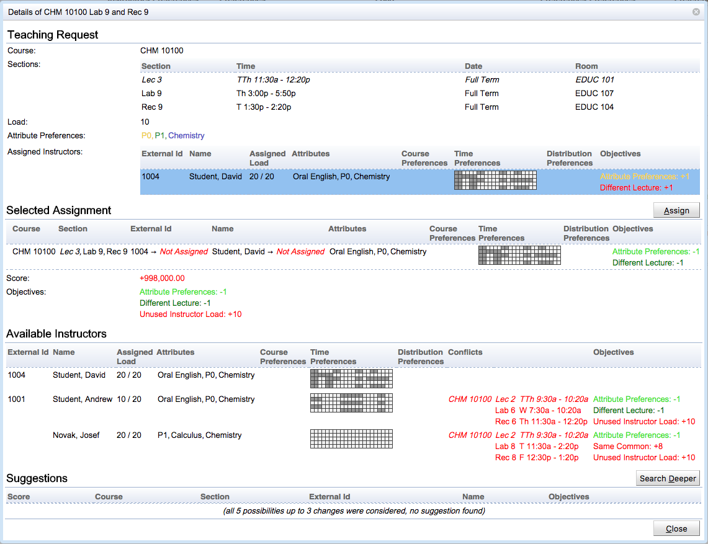{:class='screenshot'}
An example of the Teaching Request Details dialog.


 


 The dialog can switch between teaching request details and instructor details. In the Instructor Detail mode, details about the selected instructor and his/her current teaching assignments are displayed. The dialog shows details about the instructor, including a list of times when the instructor is not available because he/she is assigned to a class as an instructor (outside of the instructor scheduling problem that is being solved) or enrolled as a student. The dialog also shows current assignments of the instructor and the related criteria penalizations (objectives). The list of teaching assignments that the instructor can teach is also included.


 


 The dialog can be used to make a change in this mode too, showing the Selected Assignments (if there have been some changes proposed, e.g., by clicking on one of the available teaching assignments) and Suggestions (when the solver is loaded in memory).


 


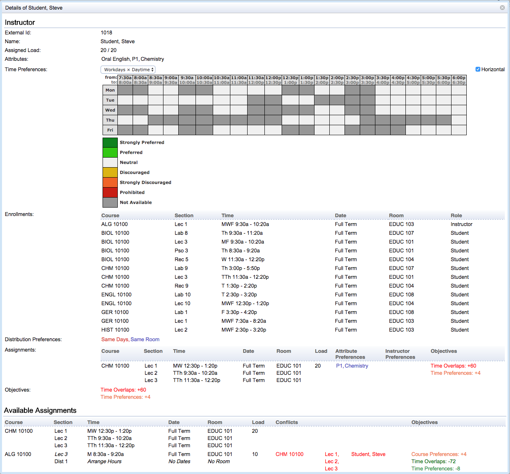{:class='screenshot'}
Example of the Instructor Details dialog

### Teaching Assignments


 Teaching Assignments page shows the same data as the Assigned / Not-Assigned Teaching Requests pages but from the instructor perspective.


 


 The table shows the list of instructors that are loaded in the solver or available for teaching assignment (and are from the selected department) together with their current teaching assignments (either taken from the current solution of the solver loaded in memory, or from the database when there is no solver loaded in for the selected department).


 


 Each line contains the external id and name of an instructor, his/her teaching preference (shown as the color of the instructor external id and name), his/her assigned / maximal teaching load, attributes, course, time and distribution preferences. Time preferences also include unavailabilities that are shown in gray. Teaching assignments are shown with their course, classes, teaching load, attribute and instructor preferences. The impact on the optimization criteria (objectives) are shown in the last column.


 

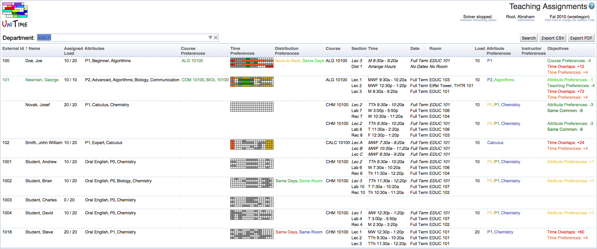{:class='screenshot'}
Example of the Teaching Assignments page


 


 The table page can be sorted by any column and particular columns can be shown / hidden using the context menu on the table header. The content of the table can be exported in CSV (comma separated value) or PDF format using the Export CSV or Export PDF buttons respectively. The exported file contains the same columns as they are currently visible on the page and the requests are ordered in the same manner as well.


 


 More details are visible when an instructor is clicked, showing the instructor detail dialog as described in the previous chapter.

### Teaching Assignment Changes


 The Teaching Assignment Changes page can be used to display changes made by the solver (or manually) when the solver is loaded in memory. The page can compare the teaching assignments of the current solution, with the best solution, initial solution (useful when the solver is used in the MPP mode), or with the data saved in the database.


 


# 6. Other Changes


 This chapter describes additional changes related to the instructor scheduling.

### Instructor Detail


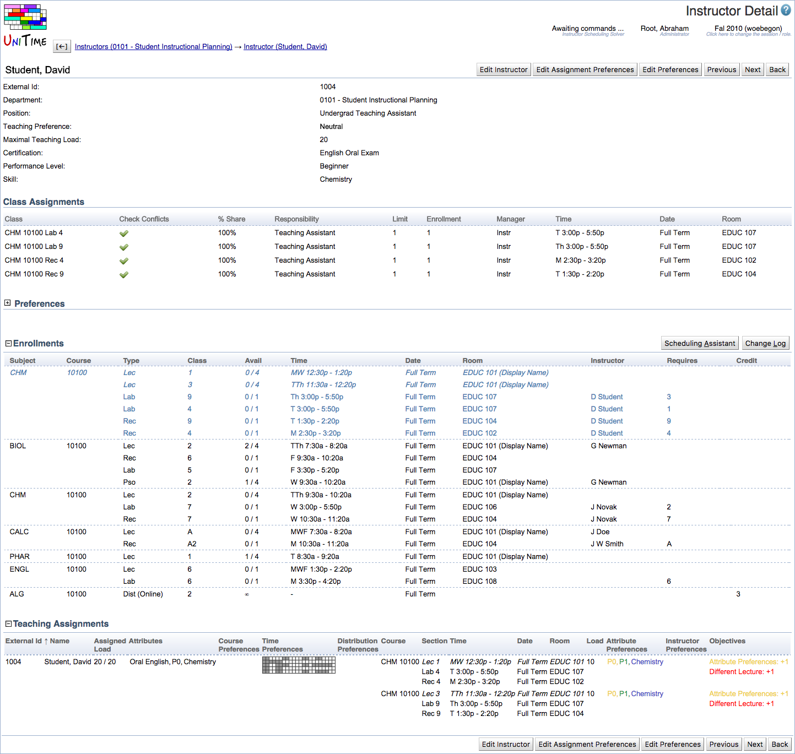{:class='screenshot'}
Example of the Instructor Detail page


 


 Besides of the new teaching preference, maximal teaching load, assigned instructor attributes, and course preferences, the Instructor Detail page contains a new table with Teaching Assignments that are assigned to the instructor. More details are shown when an assignment is clicked showing the Instructor Detail dialog as described in the Solver chapter.


 


 Also, if the instructor is also a student (there is a student with matching external id in the current academic session), the Enrollments table is displayed, showing all enrollments if the student. These include instructor assignments (dark blue color) as well as student class enrollments.

### Student Scheduling Availability


 A  student may not be available during a particular time because he/she is teaching some other class. Both batch and online solvers now consider this student/instructor availability. A student can now see his/her teaching assignments in the Scheduling Assistant as well.


 


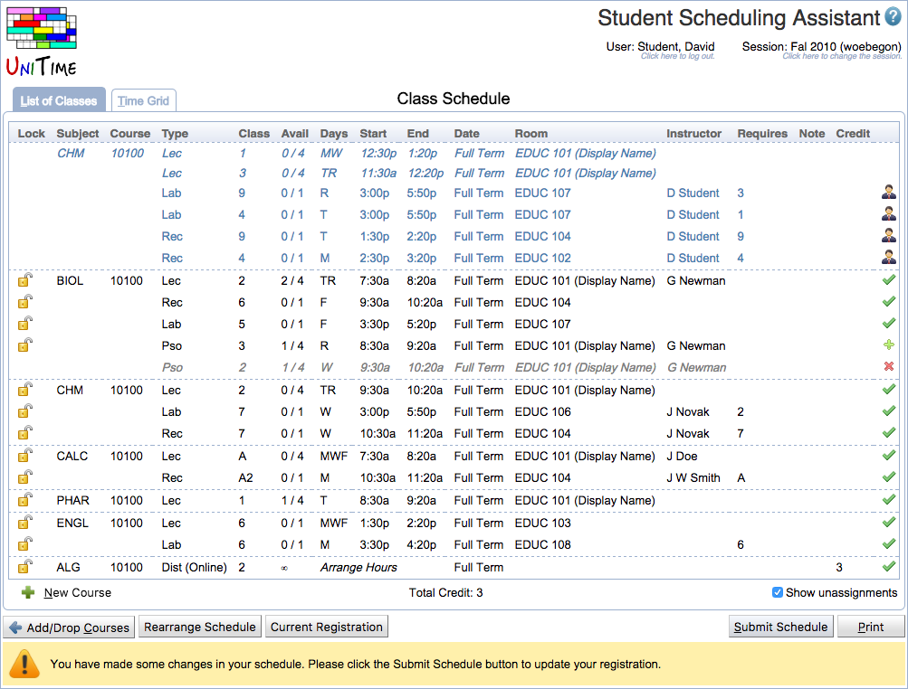{:class='screenshot'}
Teaching assignments are on top of the list, in dark blue with the teacher icon (teacher icon is not present when the student must be available during the class, but is not assigned as an instructor to it -- see Instructor Scheduling component, common classes).

### Conflict Checking


 Instructor availability is considered in the conflict checking that is used on the Instructional Offering Details page or on the Class Detail page. This means, that a class conflict is shown (among others) when a class is assigned to an instructor that is not available during the time of the class because he is enrolled into some overlapping class as a student.


 


{:class='screenshot'}
Enrollment class conflict showed on the Instructor Offering Detail page.


 More information is available in the tool-tip of the warning icon or on the Class Detail page.


 

{:class='screenshot'}
Class Detail page showing Conflicting Classes with an enrollment conflicts.


 


 There is also a new report named “TA: Teaching Conflicts” that can be used to list all teaching conflicts for a particular subject area(s). The report only lists conflicts when an instructor is assigned to a class that is overlapping in time with a class that he/she is attending as a student.


 

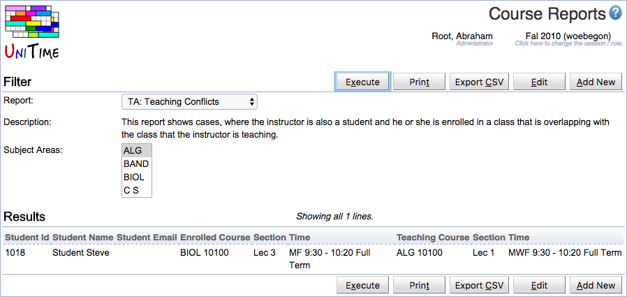{:class='screenshot'}
An example of the TA: Teaching Conflicts report


 


 The report is not available in UniTime by default, but it can be imported from [Documentation/Reports/Teaching Conflicts Report.xml](https://raw.githubusercontent.com/UniTime/unitime/master/Documentation/Reports/Teaching%20Conflicts%20Report.xml) using the Data Exchange page.

### Data Import / Export


 Instructors and teaching requests can be imported using Instructor Scheduling: Import Instructors and Instructor Scheduling: Import Teaching Requests scripts. These scripts are not available in UniTime by default, but they can be imported from [Documentation/Scripts/Instructor Assignment Imports.xml](https://raw.githubusercontent.com/UniTime/unitime/master/Documentation/Scripts/Instructor%20Assignment%20Imports.xml) using the Data Exchange page.

#### Instructor Scheduling: Import Instructors


 This import instructor script imports instructor teaching preference, maximal load, instructor attributes, and other teaching preferences. The file format is as follows:


```
ID , Name , Max Load, Preference, B2B, Course , Skill , Performance, ..., M730, M830, ...
100, Joe Doe , 20 , 0, -2, ALG 101 , Algorithms, Beginner , ..., 1, 0, ...
102, W Smith , 20 , 0, 0, , Calculus , Expert , ...., 1, 1, ...
101, G Newman, 10 , -2, 0, "BIOL 101,COM 101", "Communication,Biology", Advanced, ...
```
 


 


 Each line contains:

* **ID, Name**: Instructor external id, name, or both
    * At least one of these two columns must be present

* **Max Load**: Maximal teaching load (optional, float value, defaults to 20 when not present)

* **Preference**: Teaching preference; this column is optional, the preference is in the following format (neutral is used when not present):
    * R for required,
    * -2 for strongly preferred,
    * -1 for preferred,
    *  0 for neutral,
    * 1 for discouraged,
    * 2 for strongly discouraged,
    * P for prohibited

* **B2B**: Back-to-Back preference (optional, in the same format as teaching preference)

* **Course**: Course preference (optional, comma separated list of courses)
    * Use exclamation mark for required course, e.g., !ENGL 106
    * If there is one course listed, it is strongly preferred
    * If two or more courses are listed, they are preferred

* **Attributes:** Attributes of given type or types (optional, e.g., Skill, Qualification, etc.)
    * Column name is is the attribute type abbreviation
    * A new attribute is created when it does not exist

* **Unavailabilities** (optional)
    * One column for each day of week and hour starting between 7:30 and 17:30
    * That is M730, M830, …, M1730, T730, …, W730, …, R730, …, F730, …, F1730
    * Use 1 when available, 0 when not available

#### Instructor Scheduling: Import Teaching Requests


 This import teaching requests script imports instructor teaching requests, together with their preferences, and using the course structure. The file format is as follows:

```
Course , Subparts, Div, TA, Super, Skill , Performance
ALG 101 , Lec , , 1, 0, Algorithms , "Beginner,Expert"
BIOL 101,"Rec,Lab", 10, , 0, Biology , Advanced
CALC 101,"Lec,Rec", 10, 1, 1, Calculus ,
COM 101 , Lec , 10, , 0, Communication, Advanced
```

 


 Each line contains:

* **Course**: course for which the teaching requests are to be created

* **Subparts**: scheduling subparts that need an instructor assigned
    * If multiple subparts are indicated, they need to be in a parent-child relation

* **Div**: number of students per 1 instructor
    * Optional column, divide enrollment by this number to get the number of instructors needed per request

* **TA**: how many instructors (teaching assistants) are needed on each class
    * Only needed when **Div** is not provided

* **Super**: how many supervisors (course coordinators) are needed for the course

* **Attributes:** Attributes of given type or types that are required
    * Optional, e.g., Skill, Qualification, etc.
    * Column name is is the attribute type abbreviation

#### Data Export


 There is no export script available at the moment per se, but various pages (especially Assigned Teaching Requests, Not-Assigned Teaching Requests, and Teaching Assignments) have export CSV or PDF capability. It is also possible to filter the data and hide/show only the desired columns before the export.

### Roll Forward


 Instructor attributes and instructor teaching preferences are rolled forward together with the instructors. There is a new option to roll forward teaching requests for selected subject area(s).
