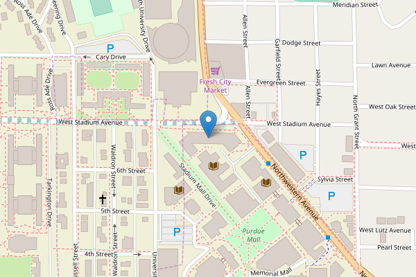
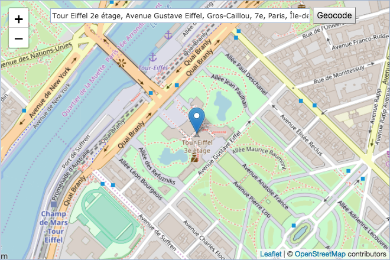

## Description

This page provides some details on how to switch from using Google Maps to [OpenStreetMap](https://www.openstreetmap.org/). The OpenStreetMap is a mature open source project that provides comparable APIs to those provided by Google. The coverage of these maps is usually quite good. The usage of these APIs is free and is expected to remain free for the foreseeable future.

**OpenStreetMap is the default since UniTime 4.4. If you have migrated from an earlier version of UniTime, you may just need to reset all the following properties to their default values.**

## Static Maps

The static maps can be created using the [staticmaplite](https://github.com/dfacts/staticmaplite) project (see [http://staticmap.openstreetmap.de](http://staticmap.openstreetmap.de) for more details). It is possible to host service at your server, use the openstreetmap.de server


{:class='screenshot'}
```
unitime.minimap.url=https://www.unitime.org/maps?center=%x,%y&zoom=16&size=600x400&maptype=mapnik&markers=%x,%y
unitime.minimap.hint=https://www.unitime.org/maps?center=%x,%y&zoom=15&size=300x200&maptype=mapnik&markers=%x,%y
```

Use UniTime to construct static maps and cache the map tiles (**new in UniTime 4.4**, using unitime.coordinates.leafletmap.tilesUrl to download the map tiles)
```
unitime.minimap.url=maps?center=%x,%y&zoom=16&size=600x400
unitime.minimap.hint=maps?center=%x,%y&zoom=15&size=300x200
```

Please note that the maps are no longer hosted by UniTime (the above properties can no longer contain https://www.unitime.org/maps/...).

For other options, see [https://wiki.openstreetmap.org/wiki/Static_map_images](https://wiki.openstreetmap.org/wiki/Static_map_images)

## Dynamic Maps

For the dynamic maps, UniTime is using the [Leaflet JS](https://leafletjs.com) library, which is very lightweight but allows to use another base map if needed (including MapQuest, MapBox, and many others). To switch from Google Maps to Leaflet maps, change the following properties (e.g., using the [Application Configuration](application-configuration) page)
```
unitime.coordinates.googlemap=false
unitime.coordinates.leafletmap=true
```


{:class='screenshot'}

You can change the map tiles using the following two properties (the table shows their defaults):
```
# Laflet maps tiles url template
unitime.coordinates.leafletmap.tilesUrl=https://{s}.tile.openstreetmap.org/{z}/{x}/{y}.png
# Laflet maps tiles attribution
unitime.coordinates.leafletmap.tilesAttribution=&copy; <a href="https://www.openstreetmap.org/copyright">OpenStreetMap</a> contributors
```

For more details about Leaflet JS, see [https://leafletjs.com](https://leafletjs.com/). Different map tiles can be explored at [http://leaflet-extras.github.io/leaflet-providers/preview](http://leaflet-extras.github.io/leaflet-providers/preview).

## Geocoding

[Nominatim](https://nominatim.openstreetmap.org/) is used for geocoding. This is used to allow for the address of the room or building to be entered on the map (geocoding) and to show the address of the selected coordinates on the map (reverse geocoding). The service can be configured using the following properties:
```
# OpenSearchMap geocoding service URL (search, see https://wiki.openstreetmap.org/wiki/Nominatim#Search)
unitime.coordinates.geocode.search=https://nominatim.openstreetmap.org/search
# OpenSearchMap geocoding service URL (reverse geocoding, see https://wiki.openstreetmap.org/wiki/Nominatim#Reverse_Geocoding)
unitime.coordinates.geocode.reverse=https://nominatim.openstreetmap.org/reverse
```

For more details, see [https://wiki.openstreetmap.org/wiki/Nominatim](https://wiki.openstreetmap.org/wiki/Nominatim)

The [Nominatim](https://nominatim.openstreetmap.org/) service is using the [Let's Encrypt](https://letsencrypt.org/) certificate. When you are using an older version of Java, you may need to import the certificate in order to avoid certificate issues during geocoding.
```
curl https://letsencrypt.org/certs/lets-encrypt-x3-cross-signed.pem.txt >lets-encrypt-x3-cross-signed.pem
keytool -import -noprompt -trustcacerts -alias lets-encrypt-x3-cross-signed -file lets-encrypt-x3-cross-signed.pem \
  -keystore cacerts -storepass changeit
keytool -list -v -keystore cacerts -storepass changeit -alias lets-encrypt-x3-cross-signed
```

See [https://stackoverflow.com/questions/34110426/does-java-support-lets-encrypt-certificates](https://stackoverflow.com/questions/34110426/does-java-support-lets-encrypt-certificates) for more detail.
