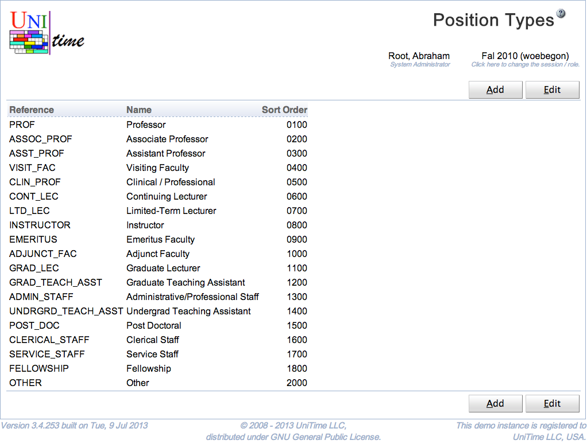

## Screen Description

The Position Types page can be used to define position types. These are used on the instructors (see [Instructors](instructors) page), each instructor can have a position type selected. Position types are not used directly by UniTime, but they can be handy for reporting purposes.

{:class='screenshot'}

## Details

Each position type has a reference, a name, and a number that is used for ordering position types. All fields are required and must be unique.

The position type reference is also used in the [staff import XML](https://www.unitime.org/interface/staffImport.xml) file.

Position types are academic session independent, relation between position types and instructors is rolled forward with the instructors. The Position Types page can be accessed with the Position Types permission, changes are permitted with the Position Type Edit permission.

## Operations

To edit or delete a position type, click on the appropriate line, [Edit Position Type](edit-position-type) page will appear. All the position types can be edited on the [Edit Position Types](edit-position-types) page. To do so, click on the **Edit** button.

A new position type can be added on the [Edit Position Types](edit-position-types) page (button **Edit**) or using [Add Position Type](add-position-type) page (button **Add**).

The table can be ordered by any of the columns. To do so, click on the column header and select Sort by <column name> option.
