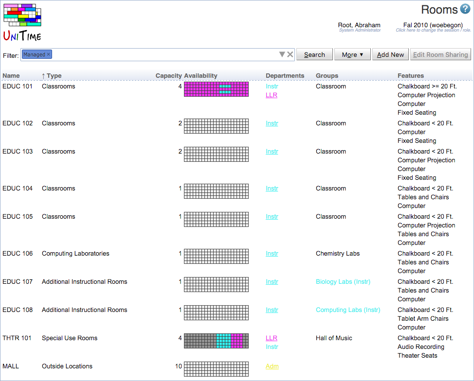
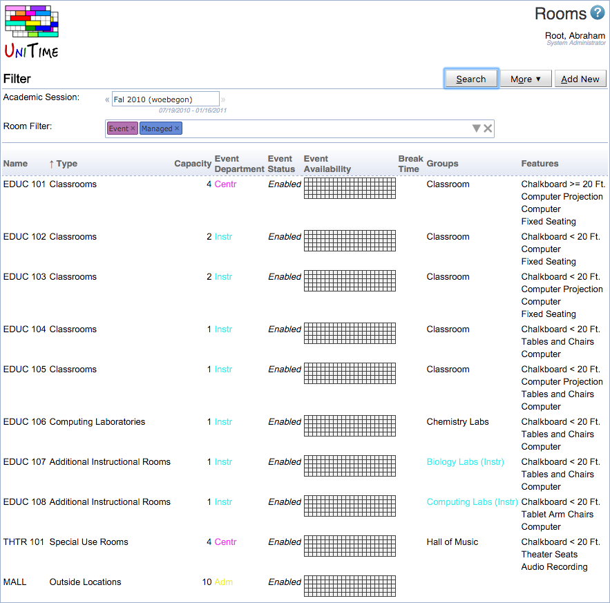

## Screen Description

 The Rooms screen provides an overview of rooms that can be used for classes, examinations or events together with the properties of these rooms, such as room features or room availability. The screen also has the capability of filtering rooms by a variety of criteria. The same Rooms screen can be accessed from different parts of the application (Courses, Examinations, Events), however, the default settings of the page (filter and visible columns) are based on this.

 When the screens is opened from the event management, the Filter also contains a section of the academic session for which the rooms are to be selected. Changes made to the display of the rooms table and the content of the filter are remembered in the browser's cookie and are also dependent on the menu item that was used to access the page. This means that the Rooms page will remember different settings when used from course timetabling than if used form examination timetabling or events.

 The screen is divided into two parts - a filter and the actual list of rooms.

## Filter

 When the page is accessed from the event management, the user can also select an academic session for which are the rooms to be displayed.

 The [Room Filter](http://help41.unitime.org/Events/Room_Filter) can be used to filter the available rooms by various parameters. Rooms can be filtered by name, department, room type, room feature, room group, building, and occupant capacity.  Filter criteria can be entered directly in the input area or selected from a dialog box activated by clicking on the triangle symbol at the right hand side of the input area.

## Operations

* **Search**
	* Search for rooms that meet the criteria from the filter

* **More**
	* The table of rooms can be customized in here, by selecting which columns should be visible, how the table is to be sorted, and the department and room availability / sharing is to be displayed.
	* Export to PDF and CSV is also available under the More button.

* **Add Room**

* Go to the [Add Room](add-room) screen to add a new room or non-university location.

* **Edit Room Sharing**
	* Go to the [Edit Room Departments](edit-room-departments) page. This operation is only available when a department or an examination type is selected in the filter.

{:class='screenshot'}

## List of Rooms

 The resulting list of rooms is displayed in the table. The following columns can be shown:

* **Name**
	* Room name including the display name if set

* **Type**

* Room type

* **Capacity**
	* Seating capacity of the room (the maximum number of students who can have a class there at the same time)
	* For rooms on campus (not non-university locations), it has to match the room inventory; for some rooms (e.g., not Classrooms), you can request a change in capacity in the [Contact Us](contact-us) screen (the category "Request any other administrative change" is best suitable)

* **Examination Capacity**

* Examination seating capacity of the room (it can be different from the "regular" capacity if there e.g. need to be free seats between students for exams)

* The number of students that can fit into the room for an exam that requires examination (as opposed to normal) seating

* **Area**

* By default it is the square footage of the room

* The unit can be changed using the [Application Configuration](application-configuration) screen

* **Coordinates**

* Room coordinates

* **Distances** (formerly known as Ignore Distances)
	* Distance check
	* When enabled, distance conflicts are checked for the room
		* By default checked, which means that the distance is checked between classes in this location and other classes (to see if students can manage to get from one class to another)
		* When unchecked, there is no time conflict between following classes (e.g. one at this location, the other one e.g. on campus) and the classes can be taught by the same instructor

* **Room Check** (formerly known as Ignore Checks)
	* When enabled, room conflicts are not allowed in the room
		* By default checked, which means that the location is considered to be an equivalent of a room - meaning e.g. that there cannot be two classes at the same time
		* When unchecked, there can be two or more classes taught at the same time at this location (this makes sense e.g. if the location is a hospital, where there can be different classes throughout the hospital at the same time)

* **Map**

* Room's position on a small map

* **Pictures**

* Room's pictures

* Only pictures with no attachment type or with an attachment type that allows visibility in the Rooms table are displayed (see [Attachment Types](attachment-types) screen)

* There is a column for each attachment type that is allowed and there is at least one room with such an attachment in the list.

* **Preference**

* Room preference (for course timetabling)

* **Availability**
	* A time grid showing how times in the room are divided among departments that share this room (the list of these departments is in the Departments column)
	* All times in white (which is the default color) are shared by all departments listed in the Departments column (and nobody else)
	* All times in gray are not available for timetabling
	* Roll your mouse over the grid to see exact times of special assignments (such as if a particular department is assigned some particular hours - for example, Instr has TTh 1:30p - 3:30p in EDUC 101 in the demo)
	* The department that controls this room can change the availability in the [Edit Room](edit-room) screen (also see the Controlling Department on the Edit Room screen)
		* Otherwise, a department can only change sharing of the times that are already assigned to it (e.g., to pass some of these times to another department)

* **Departments**
	* A list of departments sharing this room
	* The department that controls the room can add/remove departments to/from the list in the [Edit Room Availability](edit-room-availability) screen

* **Control**
	* Checked if the department selected in the drop-down list controls the room
	* If checked, the department can set up sharing of this room with other departments (in the [Edit Room Availability](edit-room-availability) screen)

* **Examination Types**

* Examination types for which the room is enabled (e.g., only rooms enabled for Final Examinations can be used for timetabling of final exams)

* **Period Preferences**

* Examination period preferences for the room and the selected examination type

* Preferences for periods during which exams can be held in this room

* **Event Department**

* Department that controls the room for the event management

* **Event Status**

* Event management status

* The default status for an event department and room type can be set on the [Event Statuses](event-statuses) screen and overridden on a particular room if needed

* **Event Availability**

* Availability of the room for event management

* All times in gray are not available for event management

* **Event Message**

* A message to be displayed in the event management, when the room is requested for an event.

* The default message for an event department and room type can be set on the [Event Statuses](event-statuses) screen and overridden on a particular room if needed

* **Break Time**

* Number of minutes indicating how long the room should be blocked for this event after the official end of the event; it is similar to the break time after classes

* For course related events that require the students to attend, the students are also blocked during the break time and e.g. if examinations are to be timetabled, there would be a conflict if the break time overlapped with an examination

* The default break time for an event department and room type can be set on the [Event Statuses](event-statuses) screen and overridden on a particular room if needed

* **Groups**
	* A list of groups to which this room belongs (for example, EDUC 101 belongs to the Classroom room group)
	* You can add (or remove) the room to (or from) a group in the [Edit Room](edit-room) screen
	* Read more about room groups in the description of the [Room Groups](room-groups) screen

* **Features**
	* A list of room features
	* An example of global room features defined for all rooms:
		* **Audio Recording** (Audio)
		* **Chalkboard<20 Ft** (Chkbd<20Ft)
		* **Chalkboard>=20 Ft** (Chkbd>=20Ft)
		* **Computer** (Comptr)
		* **Computer Projection** (CmptProj)
		* **Tables and Chairs** (T&C)
		* **Tablet Arm Chairs** (TArmC)
	* Room features of a particular room feature type are displayed in a separate column (named after the feature type)

 When working with rooms from your department, click on any line with information about a room to get to its [Room Detail](room-detail) screen. You will be able to change some properties of the room, such as availability or room sharing, in screens accessible from this [Room Detail](room-detail) screen.

{:class='screenshot'}
