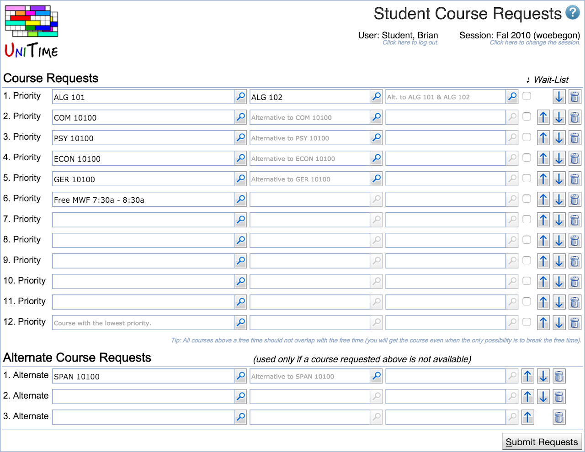

## Screen Description

The Student Course Requests page can be used to collect course requests (course pre-registrations) from students. It is a variant of the [Student Scheduling Assistant](student-scheduling-assistant) page, without the ability to create a student schedule right away. The course requests can be collected during the timetabling process, once it is known which courses are going to be offered. Once student course requests are collected, the [Student Sectioning Solver](student-scheduling-solver) can be used to create an optimize schedule for all the students. After that the online student scheduling can be enabled, so that students can use the [Student Scheduling Assistant](student-scheduling-assistant) page to review their schedule and/or to make any modifications they need/desire.

{:class='screenshot'}

Courses and PrioritiesThe student can use the screen to set up a list of prioritized courses with alternatives and free time requests.

**Course Requests**

Table of courses ordered by student's priority (courses on the first line have the highest priority). Each course can have up to two alternatives that have the same priority for the student as their first choice on a given line. The second or third choice are only used if the first choice is unavailable or does not fit with higher priority courses in the list.

Click on the magnifying glass to get to the [Course Finder](course-finder) screen for more information about possible courses.

To move a line with a course and its alternatives one line up or one line down, click on the appropriate arrow at the end of the line.

If a course (or any of its alternatives, if provided) is not available to the student for some reason, it is possible to either give an additional course (see the Alternate Course Requests table bellow) or toggle the Wait-List checkbox. If the Wait-List is marked and the student cannot be enrolled into the course, they will be automatically put on a wait-list for the course.

**Alternate Course Requests**

Table of alternative courses in the order of priority. These alternatives will be used if some of the courses from the Courses table and their alternatives cannot be scheduled (due to conflicts with higher priority courses or because they are full already).

**Operations**

* **Submit Requests**
	* Store the entered data in the database.

## Notes

The user must click the Submit Request button in order to persist the changed made on the page.

**Free time requests**

There are two ways to enter a free time request

1. In the list of courses, enter the request in the form of "Free F 10:00a - 10:30a" or "Free TR 2:00p - 3:00p" etc.
2. Go to the [Course Finder](course-finder) screen and click on the "Free Time" tab; then click on the times that should stay free and then press Enter

**Shortcuts for navigation through the Courses or Alternatives table**

* **Windows (Firefox)**
	* Moving a course up or down the list of courses
		* Click on any editable field of a line and press "Ctrl+Shift+↑" to move the course up the list of courses 
		* Click on any editable field of a line and press "Ctrl+Shift+↓" to move the course down the list of courses
	* Jumping through the editable fields in the table
		* Ctrl+↑ - move one editable field up
		* Ctrl+↓ - move one editable field down
		* Ctrl+→ - move one editable field to the right
		* Ctrl+← - move one editable field to the left

* **Mac (Chrome, Firefox, Safari)**
	* Moving a course up or down the list of courses
		* Click on any editable field of a line and press "control+↑" to move the course up the list of courses 
		* Click on any editable field of a line and press "control+↓" to move the course down the list of courses
	* Jumping through the editable fields in the table (it is also possible to use the "command" button instead of "alt")
		* alt+↑ - move one editable field up
		* alt+↓ - move one editable field down
		* alt+→ - move one editable field to the right
		* alt+← - move one editable field to the left
