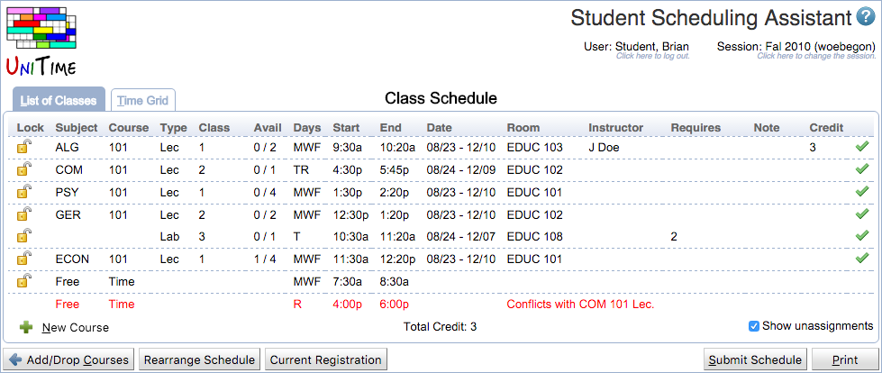
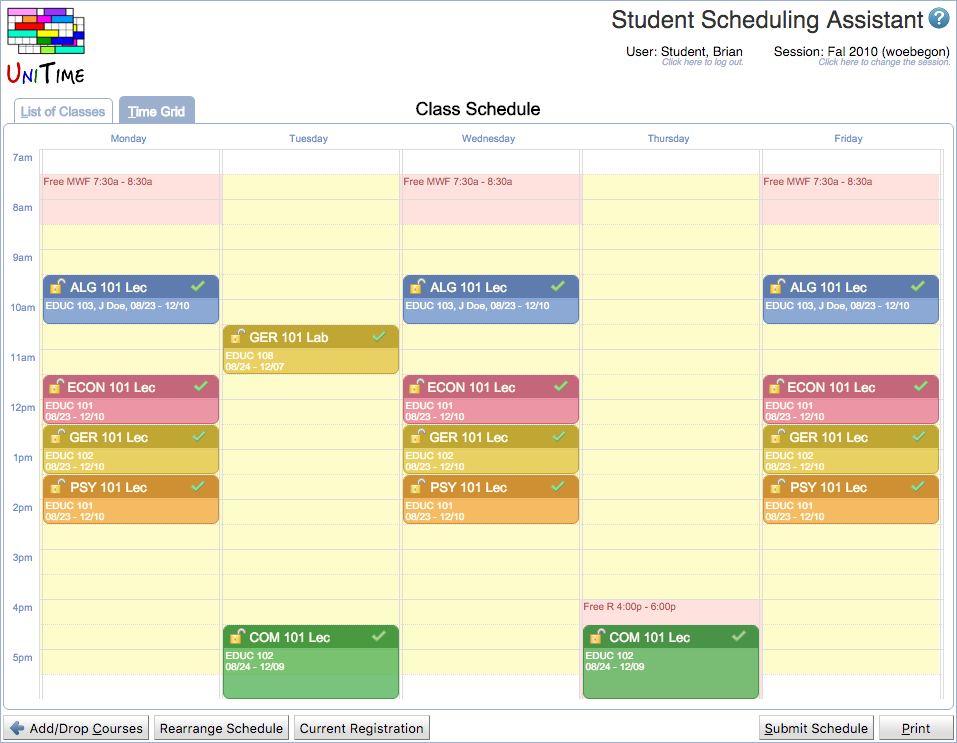

## Screen Description

The Student Scheduling Assistant helps students build a workable class schedule.  It takes a list of courses a student is interested in and determines the class sections the student needs to take in order to get as many of the courses being requested as possible.  The Student Scheduling Assistant tries to calculate a schedule for the student based on the following criteria:

* the student’s priority for the course

* the student’s free time requests

* the student must be able to attend all parts of the course

* provide as many of the selected courses as possible

* the distance between back-to-back classes (if distance between two classes is greater than a normal person can cover during the break time a roadrunner icon is displayed)

* whether an overlap is allowed between two classes

* keep existing schedule as much as possible

* alternative courses are only used if a selected course is not available

* a section choice that prevents the fewest future students from also getting the course

Once the assistant has suggested a schedule a student can make changes to the schedule until she finds a combination of time for the classes that meets her needs.

In the Student Scheduling Assistant screen, a student may enter a prioritized list of courses they would like to take in a given term. It is also possible to enter course alternatives and free time requests. Then a personal schedule is offered to the student and they can enroll in the classes as offered.

{:class='screenshot'}

## Courses and Priorities

The student begins with the screen in this mode to set up a list of prioritized courses with alternatives and free time requests.

### Course Requests

Table of courses ordered by student's priority (courses on the first line have the highest priority). Each course can have up to two alternatives that have the same priority for the student as their first choice on a given line. The second or third choice are only used if the first choice is unavailable or does not fit with higher priority courses in the list.

Click on the magnifying glass to get to the [Course Finder](course-finder) screen for more information about possible courses.

To move a line with a course and its alternatives one line up or one line down, click on the appropriate arrow at the end of the line.

### Alternate Course Requests

Table of alternative courses in the order of priority. These alternatives will be used if some of the courses from the Courses table and their alternatives cannot be scheduled (due to conflicts with higher priority courses or because they are full already).

### Operations

* **Current Registration**
	* Discard all changes and reset the page back to the current registration

* **Build Schedule**
	* Run the scheduling assistant, then display the resulting timetable

## Personal Schedule

The Personal Schedule mode of the Student Scheduling Assistant screen presents a list of classes with their assigned times and rooms to which further changes can be made. The user can click on any class and get to the [Alternatives](alternatives-for-class) screen where there are options for change (if any change is possible) - for example, to take a course at a different time or in a different location.

{:class='screenshot'}

### List of Classes

* **Lock**
	* When checked, the class cannot be changed in the [Alternatives](alternatives-for-class) screen - the changes that would include the class are not even displayed

* **Subject**
	* Subject area of the class

* **Course**
	* Course that contains the class

* **Type**
	* Type of class (Lecture, Recitation, ...)

* **Class**
	* Identification of the class

* **Avail**
	* Number of free, still available seats / capacity of the class 

* **Days**
	* Days of the week

* **Start**
	* Start time of the class

* **End**
	* End time of the class

* **Date**
	* Dates during the semester on which the class is taught

* **Room**
	* Room where the class meets
	* If there is this road runner icon, it means that the room is far from the previous class; roll the mouse over the icon to see the distance to travel from the room of the previous class to here

* **Instructor**
	* Instructor for the class
	* Click on the envelope icon to send an email to the instructor (if there is no icon, the email address is not available)

* **Requires**
	* Identification of other classes from the List of Classes that are required to be taken together with this class (for example, a specific lecture may be required for a given recitation)

* **Note**
	* Consent, if a departmental or instructor consent is required.
		* Course schedule of classes note, if present
		* Class schedule note, if present
	* **Credit**
		* Number of credits
	* **Status Icons**
		* **Green checkmark:** You are currently registered for the given class.
		* **Red cross:** You are currently registered for the given class. This enrollment will get dropped when Submit Schedule button is clicked.
		* **Green plus:** You are currently not registered for the given class. Please click the Submit Schedule button to update your registration.
		* **Red circle exclamation mark:** Registration for the given class has failed. The appropriate error message is in the tool tip.
		* **Yellow triangle exclamation mark:** Course of the given class is currently undergoing maintenance / changes.
		* **Two overlapping rectangles:** Given class is overlapping with some other class. If classes are allowed to overlap, the overlapping time is minimised instead.
		* **Two people icon:** There are more students expected than seats available; please, try to avoid this class if possible. To see if another class is available, click on the class; that will take you to the [Alternatives](alternatives-for-class) screen.
		* **Red circle cross:** The class has been cancelled. 

Click on any class in the list to get to the [Alternatives](alternatives-for-class) screen to see if there are alternative times or rooms for that class.

There is a small toggle **Show unassignments** in the lower right-hand corner. When the checkbox is checked, any classes that would be unassigned as a result of the current work with the Student Scheduling Assistant will be displayed.

### Time Grid

Student's schedule displayed as a time grid (as opposed to a list of classes).Click on any class in the timetable to get to the [Alternatives](alternatives-for-class) screen to see if there are alternative times or rooms for that class.

{:class='screenshot'}

### Student Availability

A student may not be available during a particular time because they are teaching some other class. Both batch and online solvers now consider this student/instructor availability. A student can now see their teaching assignments in the Scheduling Assistant as well.

{:class='screenshot'}

Teaching assignments are on top of the list, in dark blue with the teacher icon (teacher icon is not present when the student must be available during the class, but is not assigned as an instructor to it -- see [Instructor Scheduling](instructor-scheduling) component, common classes).

## Operations

* **Add/Drop Courses** 
	* Go back to the list of prioritized courses and course alternatives

* **Rearrange Schedule**
	* Reschedule the requested courses all over again (as opposed to just adding a new course with as few changes as possible, which happens when a course is added to the prioritized list in the previous screen)

* **Current Registration**
	* Discard all changes and reset the page back to the current registration

* **Submit Schedule**
	* Enroll the student in the classes displayed in the List of Classes or in the Timetable
	* This option is available when Online Sectioning is enabled for the academic session

* **Print**
	* Print out the Timetable and the List of Classes

* **Export** (if enabled)
	* Export the timetable as an iCalendar file

* **+ New Course** (in the bottom right corner of the List of Classes tab)
	* Quickly add a new course to the current schedule without going back to the Course Requests table. When clicked a [Course Finder](course-finder) dialog appears. When a course is selected:
		* If the course is already present in the Course Requests table, the user if given the choice to drop the course (remove it from the schedule).
			* If a new course is selected, [Alternatives](alternatives-for-class) dialog shows up with possible choices (if there are any). The course is only added to the schedule when a choice is selected.

## Notes

**Free time requests**

There are two ways to enter a free time request

1. In the list of courses, enter the request in the form of "Free F 10:00a - 10:30a" or "Free TR 2:00p - 3:00p" etc.
2. Go to the [Course Finder](course-finder) screen and click on the "Free Time" tab; then click on the times that should stay free and then press Enter

**Shortcuts for navigation through the Courses or Alternatives table**

* **Windows (Firefox)**
	* Moving a course up or down the list of courses
		* Click on any editable field of a line and press "Ctrl+Shift+↑" to move the course up the list of courses
		* Click on any editable field of a line and press "Ctrl+Shift+↓" to move the course down the list of courses
	* Jumping through the editable fields in the table
		* Ctrl+↑ - move one editable field up
		* Ctrl+↓ - move one editable field down
		* Ctrl+→ - move one editable field to the right
		* Ctrl+← - move one editable field to the left

* **Mac (Chrome, Firefox, Safari)**
	* Moving a course up or down the list of courses
		* Click on any editable field of a line and press "control+↑" to move the course up the list of courses
		* Click on any editable field of a line and press "control+↓" to move the course down the list of courses
	* Jumping through the editable fields in the table (it is also possible to use the "command" button instead of "alt")
		* alt+↑ - move one editable field up
		* alt+↓ - move one editable field down
		* alt+→ - move one editable field to the right
		* alt+← - move one editable field to the left
